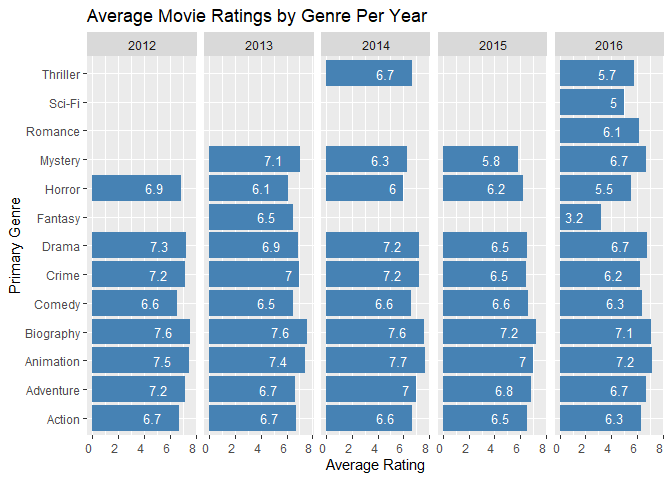
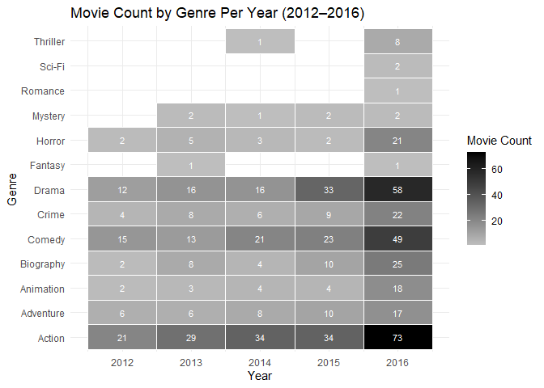
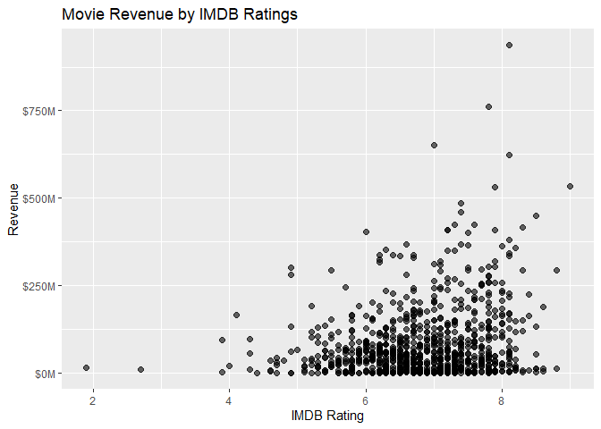

# Data Visualization Project 01

&nbsp;&nbsp;&nbsp;&nbsp; Originally when creating my visualizations I wanted to explore the relationship between IMDB ratings and revenue from each movie. I choose this visual becasue it shows the relationship between revenue and the IMDB rating of each movie. This highlights the correlation that higher rated movies are usually the ones making the most revenue; naturally bad movies have a difficult time drawing viewers. Still, there are plenty of movies that scored high on their scale that did have high revenue. But compared to the total data set there is not a strong pattern. This is evident because there are plenty of movies that scored higher than an 8 but still made little to no profit.


```r
p <- data %>%
  ggplot(aes(x = Rating, y = `Revenue (Millions)`,
             text = paste("Title:", Title,        # add hover info
                          "<br>Rating:", Rating,
                          "<br>Revenue: $", `Revenue (Millions)`, "M"))) +
  geom_point(alpha = 0.6, size = 2) +
  scale_y_continuous(labels = dollar_format(suffix = "M", prefix = "$")) +
  labs(
    title = "Movie Revenue by IMDB Ratings",
    x = "IMDB Rating",
    y = "Revenue",
  ) +
  theme_bw()

ggplotly(p, tooltip = "text")
```

```{=html}
<div id="htmlwidget-d6c787aafb4b6e2a2205" style="width:672px;height:480px;" class="plotly html-widget"></div>
<script type="application/json" data-for="htmlwidget-d6c787aafb4b6e2a2205">{"x":{"data":[{"x":[8.1,7,7.3,7.2,6.2,6.1,8.3,6.4,7.1,7,7.5,7.8,7.9,7.7,6.4,6.6,8.2,6.7,8.1,8,6.7,7.9,6.7,6.5,5.3,6.8,8.3,4.7,6.2,5.9,6.3,7.5,7.1,8,5.6,7.9,8.6,7.6,6.9,7.1,6.3,7.5,2.7,7.2,6.3,6.7,7.3,5.6,7.1,3.7,8.1,5.8,5.6,7.2,9,7.3,7.2,7.4,7,7.5,6.7,6.8,6.5,4.1,8.5,7.7,7.4,8.1,7.5,7.2,5.9,7.1,7.5,6.8,8.1,7.1,8.1,8.3,7.3,5.3,8.8,7.9,8.2,8.1,7.2,7,6.4,7.8,7.8,7.4,8.1,7,8.1,7.1,7.4,7.4,8.6,5.8,6.3,8.5,7,7,8,7.9,7.3,7.7,5.4,6.3,5.8,7.7,6.3,8.1,6.1,7.7,8.1,5.8,6.2,8.8,7.2,7.4,6.7,6.7,6,7.4,8.5,7.5,5.7,6.6,6.4,8,7.3,6,6.4,8.5,7.1,7.3,8.1,7.3,8.1,7.1,8,6.2,7.8,8.2,8.4,8.1,7.4,7.6,7.6,6.2,6.4,7.2,5.8,7.6,8.1,4.7,7,7.4,7.5,7.9,6,7,8,6.1,8,5.2,6.5,7.3,7.3,6.8,7.9,7.9,5.2,8,7.5,6.5,7.6,7,7.4,7.3,6.7,6.8,7,5.9,8,6,6.3,6.6,7.8,6.3,7.2,5.6,8.1,5.8,8.2,6.9,6.3,8.1,8.1,6.3,7.9,6.5,7.3,7.9,5.7,7.8,7.5,7.5,6.8,6.7,6.1,5.3,7.1,5.8,7,5.5,7.8,5.7,6.1,7.7,6.7,7.1,6.9,7.8,7,7,7.1,6.4,7,4.8,8.2,5.2,7.8,7.4,6.1,8,6.8,3.9,8.1,5.9,7.6,8.2,5.8,6.5,5.9,7.6,7.9,7.4,7.1,8.6,4.9,7.3,7.9,6.7,7.5,7.8,5.8,7.6,6.4,7.1,7.8,8,6.2,7,6,4.9,6,7.5,6.7,3.7,7.8,7.9,7.2,8,6.8,7,7.1,7.7,7,7.2,7.3,7.6,7.1,7,6,6.1,5.8,5.3,5.8,6.1,7.5,7.2,5.7,7.7,7.1,6.6,5.7,6.8,7.1,8.1,7.2,7.5,7,5.5,6.4,6.7,6.2,5.5,6,6.1,7.7,7.8,6.8,7.4,7.5,7,5.2,5.3,6.2,7.3,6.5,6.4,7.3,6.7,7.7,6,6,7.4,7,5.4,6.9,7.3,8,7.4,8.1,6.1,7.8,5.9,7.8,6.5,6.6,7.4,6.4,6.8,6.2,5.8,7.7,7.3,5.1,7.7,7.3,6.6,7.1,6.7,6.3,5.5,7.4,7.7,6.6,7.8,6.9,5.7,7.8,7.7,6.3,8,5.5,6.9,7,5.7,6,6.8,6.3,6.7,6.9,5.7,6.9,7.6,7.1,6.1,7.6,7.4,6.6,7.6,7.8,7.1,5.6,6.7,6.7,6.6,6.3,5.8,7.2,5,5.4,7.2,6.8,5.5,6,6.1,6.4,3.9,7.1,7.7,6.7,6.7,7.4,7.8,6.6,6.1,7.8,6.5,7.3,7.2,5.6,5.4,6.9,7.8,7.7,7.2,6.8,5.7,5.8,6.2,5.9,7.8,6.5,8.1,5.2,6,8.4,4.7,7,7.4,6.4,7.1,7.1,7.6,6.6,5.6,6.3,7.5,7.7,7.4,6,6.6,7.1,7.9,7.8,5.9,7,7,6.8,6.5,6.1,8.3,6.7,6,6.4,7.3,7.6,6,6.6,7.5,6.3,7.5,6.4,6.9,8,6.7,7.8,6.4,5.8,7.5,7.7,7.4,8.5,5.7,8.3,6.7,7.2,6.5,6.3,7.7,6.3,7.8,6.7,6.7,6.6,8,6.5,6.9,7,5.3,6.3,7.2,6.8,7.1,7.4,8.3,6.3,7.2,6.5,7.3,7.9,5.7,6.5,7.7,4.3,7.8,7.8,7.2,5,7.1,5.7,7.1,6,6.9,7.9,6.2,7.2,5.3,4.7,6.6,7,3.9,6.6,5.4,6.4,6.7,6.9,5.4,7,6.4,7.2,6.5,7,5.7,7.3,6.1,7.2,7.4,6.3,7.1,5.7,6.7,6.8,6.5,6.8,7.9,5.8,7.1,4.3,6.3,7.1,4.6,7.1,6.3,6.9,6.6,6.5,6.5,6.8,7.8,6.1,5.8,6.3,7.5,6.1,6.5,6,7.1,7.1,7.8,6.8,5.8,6.8,6.8,7.6,6.3,4.9,4.2,5.1,5.7,7.6,5.2,7.2,6,7.3,7.2,7.8,6.2,7.1,6.4,6.1,7.2,6.6,6.2,7.9,7.3,6.7,6.4,6.4,7.2,5.1,7.4,7.2,6.9,8.1,7,6.2,7.6,6.7,7.5,6.6,6.3,4,6.9,6.3,7.3,7.3,6.4,6.6,5.6,6,6.3,6.7,6,6.1,6.2,6.7,6.6,7,4.9,8.4,7,7.5,7.3,5.6,6.7,8,8.1,4.8,7.5,5.5,8.2,6.6,3.2,5.3,5.6,7.4,6.4,6.8,6.7,6.4,7,7.9,5.9,7.7,6.7,7,6.9,7.7,6.6,7.1,6.6,5.7,6.3,6.5,8,6.1,6.5,7.6,5.6,5.9,7.2,6.7,7.2,6.5,7.2,6.7,7.5,6.5,5.9,7.7,8,7.6,6.1,8.3,7.1,5.4,7.8,6.5,5.5,7.9,8.1,6.1,7.3,7.2,5.5,6.5,7,7.1,6.6,6.5,5.8,7.1,6.5,7.4,6.2,6,7.6,7.3,8.2,5.8,6.5,6.6,6.2,5.8,6.4,6.7,7.1,6,5.1,6.2,6.2,6.6,7.6,6.8,6.7,6.3,7,6.9,6.6,7.7,7.5,5.6,7.1,5.7,5.2,5.4,6.6,8.2,7.6,6.2,6.1,4.6,5.7,6.1,5.9,7.2,6.5,7.9,6.3,5,7.3,5.2,6.6,5.2,7.8,7.5,7.3,7.3,6.6,5.7,8.2,6.7,6.2,6.3,5.7,6.6,4.5,8.1,5.6,7.3,6.2,5.1,4.7,4.8,7.2,6.9,6.5,7.3,6.5,6.9,7.8,6.8,4.6,6.7,6.4,6,6.3,6.6,7.8,6.6,6.2,7.3,7.4,6.5,7,4.3,7.2,6.2,6.2,6.8,6,6.6,7.1,6.8,5.2,6.7,6.2,7,6.3,7.8,7.6,5.4,7.6,5.4,4.6,6.9,6.8,5.8,7,5.8,5.3,4.6,5.3,7.6,1.9,7.2,6.4,7.4,5.7,6.4,6.3,7.5,5.5,4.2,7.8,6.3,6.4,7.1,7.1,6.8,7.3,6.7,7.8,6.3,7.5,6.8,7.4,6.8,7.1,7.6,5.9,6.6,7.5,6.4,7.8,7.2,8.4,6.2,7.1,6.3,6.5,6.9,6.9,6.6,6.9,7.7,2.7,5.4,7,6.6,7,6.9,7.3,5.8,5.8,6.9,7.5,6.3,6.9,6.1,7.5,6.8,6.5,5.5,7.7,3.5,6.2,7.1,5.5,7.1,7.1,7.1,7.9,6.5,5.5,6.5,5.6,6.8,7.9,6.2,6.2,6.7,6.9,6.5,6.6,6.4,4.7,7.2,7.2,6.7,7.5,6.6,6.7,7.5,6.1,6.4,6.3,6.4,6.8,6.1,4.9,7.3,5.9,6.1,7.1,5.9,6.8,5.4,6.3,6.2,6.6,4.4,6.8,7.3,7.4,6.1,4.9,5.8,6.1,6.4,6.9,7.2,5.6,4.9,6.1,7.8,7.3,4.3,7.2,6.4,6.2,5.2,7.7,6.2,7.8,7,5.9,6.7,6.3,6.9,7,6.7,7.3,3.5,6.5,4.8,6.9,5.9,6.2,7.4,6,6.2,5,7,7.6,7,5.3,7.4,6.5,6.8,5.6,5.9,6.3,7.1,7.5,6.6,8.5,6.3,5.9,6.7,6.2,5.5,6.2,5.6,5.3],"y":[333.13,126.46,138.12,270.32,325.02,45.13,151.06,null,8.01,100.01,234.02,169.27,532.17,248.75,2.87,368.31,67.12,162.16,51.69,100.5,7.22,47.7,null,153.69,103.14,null,6.5,0.01,113.08,54.65,60.31,10.64,155.33,363.02,26.84,408.08,187.99,232.6,93.38,null,97.66,27.85,null,12.79,4.21,241.06,3.44,null,158.8,null,936.63,30.35,32.46,43,533.32,7.08,89.21,56.23,3.18,125.07,330.25,null,75.31,166.15,53.08,128.25,31.86,153.63,0.01,61.28,null,40.07,3.73,30.98,341.26,309.4,623.28,120.52,423.03,128.34,292.57,5.88,116.87,167.74,350.03,652.18,10.38,760.51,54.12,86.2,60.96,47.17,169.71,43.02,458.99,36.25,4.68,0.15,1.29,132.37,1.87,181.02,228.43,null,45.43,26.86,1.66,126.59,null,25.44,10.16,56.67,null,210.59,380.96,54.73,1.33,11.15,71.9,486.29,87.24,150.83,46.01,null,448.13,364,245.43,38.56,143.7,183.64,57.64,128,55.12,13.09,238.67,21.38,74.27,144.81,127.97,null,257.7,64,70.24,14.68,162.8,2.01,14.26,107.5,121.46,34.26,55.47,408,0.2,46.88,null,41.8,101.79,84.24,31.49,23.62,null,1.8,233.91,58.4,167.01,191.45,65.03,33.31,52.82,200.07,32.28,48.02,null,25.56,400.74,93.42,208.54,110.42,102.46,180.19,24.09,25.14,201.15,null,3.4,null,1.72,31.06,35.05,110.01,12.53,null,44.99,3.91,13.65,176.64,null,18.35,91.12,127.38,100.19,8.1,21.48,318.3,66,146.41,0.51,2.14,169.08,null,155.18,14.12,318.76,null,206.36,31.14,259.75,33.04,null,48.04,9.24,244.05,14.67,102.52,150.37,0.66,8.7,52,241.41,null,37.62,0,50.86,195,47.95,17.74,13.96,2.41,59.07,26.62,85.71,356.45,9.4,89.73,88.76,148.78,35.29,5.66,110.82,13.18,0.32,0.11,161.03,202.85,137.39,277.31,65.17,176.74,67.24,2.27,42.34,106.95,4.4,0.79,0.54,0.03,35.54,27.1,179.88,null,304.36,303,138.45,3.23,null,89.02,191.62,33.05,3.37,408.99,117.7,209.02,null,12.71,72.66,36.38,14.9,47.38,17.36,null,2.13,65,55.29,null,291.02,18.71,64.06,124.73,15.43,40.22,101.53,125.07,42.04,48.24,31.58,8.09,77.04,null,62.49,46.81,255.95,2.2,0.92,255.11,292,4.56,34.91,null,65.07,209.81,65.27,0.01,5.69,37.55,96.92,27.36,5.77,0.04,3.22,7.1,72.66,350.12,27.3,182.2,26.9,null,132.09,null,124.87,46.28,155.02,66.47,73.1,76.2,336.53,20.32,38.35,150.12,16.2,56.82,null,56.44,2.02,11.08,130,17.18,null,35.89,101.47,15.29,100.47,0.05,228.76,75.59,30,141.32,292.3,null,262.03,26.38,3.85,102.41,14.27,134.57,27.37,2.2,62.56,109.71,4.21,39.29,3.33,52.42,null,72.31,257.76,43.25,78.75,105.22,132.55,73.06,20.57,10.64,17.75,null,133.67,42.48,134.52,109.18,null,113.71,336.03,null,0.1,251.5,26.76,0.23,95.72,200.81,281.67,58.88,145,183.44,268.49,null,21.2,1.82,null,50.92,294.98,4,40.25,0.04,10.91,106.37,62.4,127.49,13.75,227.14,null,79,6.52,28.84,202.35,209.36,null,0.03,37.43,19,28.75,null,234.9,38.32,75.28,9.7,null,46.98,13.4,5.2,222.49,35.27,312.06,1.82,10.33,98.9,55.09,0.61,163.95,90.35,103.03,22.88,92.17,35.79,4.07,null,80.02,186.83,118.31,1.01,115.65,119.22,130.13,15.96,166.11,301.96,136.02,15.79,11.28,null,null,null,62.88,45.09,12.63,null,107.51,45.51,118.82,71.35,53.85,206.44,0.02,94.82,80.03,28.77,2.61,256.39,179.02,126.98,73.34,292.98,81.69,0.25,null,2.7,null,null,47.31,32.39,8.83,274.08,9.03,46.98,64.51,66.01,null,58.4,65.01,31.57,258.36,0.05,2.96,16.97,23.05,null,0.06,93.05,null,7.19,200.66,113.17,7.46,64.03,null,126.55,1.08,43.57,58.68,0.54,null,null,15.52,79.24,null,53.68,null,3.71,4.42,334.19,0.11,null,118.68,7.7,56.11,null,null,35.39,43.77,55.94,24.99,0.44,102.98,54.24,48.06,189.41,155.11,34.96,352.36,143.49,4.2,41.01,83.91,127.71,75.27,59.89,4.85,163.19,27.55,172.05,424.65,0.58,131.56,null,38.54,41.1,75.61,115.8,115.6,83.5,3.68,237.28,10.1,0.32,10.72,2.34,150.32,12.13,24.85,6.86,5.01,148.34,46,93.95,null,143.52,6.53,null,null,117.53,3.49,75.75,19.45,1.48,43.98,3.9,24.48,0.04,20.76,null,0.03,58.23,17.47,62.32,0.4,65,89.25,58.88,234.36,null,null,113.73,32.36,6.11,2.2,null,223.81,148.73,54.7,37.4,31.54,56.72,162.59,3.08,null,0.86,null,148.09,13.65,null,0.03,7.79,52.88,null,53.99,9.39,null,97.03,25.36,190.87,17.11,0.03,87.34,0.02,20.3,159.58,0.28,12.8,0.05,81.26,49.87,57.37,null,1.21,15.7,116.59,null,25.59,25.12,0.01,34.02,0.54,337.1,1.74,14.01,31.17,69.95,138.8,0.15,80.17,414.98,24.1,42.35,1.4,1.36,23.22,124.98,null,0.2,0.33,134.52,null,1.29,218.63,90.36,49.55,23.23,null,62.45,1.02,47.11,5.73,402.08,0.92,50.15,6.86,36.77,197.99,32.36,52.53,101.16,150.06,0.33,37.88,162,20.75,176.59,79.71,55.8,39.83,77.21,0.32,44.67,37.37,null,217.54,0.69,73.82,0.02,39.38,0.56,102.18,63.03,4.71,20.17,171.03,3.59,42.62,null,3.65,34.9,68.56,39,27.69,7.76,54.76,null,0.06,null,null,21.27,93.57,31.66,31.24,18.7,101.11,64.42,10.57,61.66,317.01,31.99,0.34,168.37,null,217.39,42.27,10.14,191.45,0.78,null,null,3.86,61.09,12.28,28.48,null,0.04,107.1,null,3.77,169.69,227.95,87.03,36.92,31.45,0.29,18.6,70.63,5.48,368.05,25.98,26,null,14.99,82.16,50.55,71.98,33.63,90.76,6.85,3.9,null,0.05,71.59,41.57,16.68,21,88.5,null,18.33,84.26,null,null,7.69,150.17,0.3,null,null,6.88,null,25.03,14.17,70.27,49,11.23,70.22,59.62,5.98,0.13,100.02,null,null,54.41,1.98,3.03,104.37,81.56,93.75,177.34,0.09,null,95,81.16,16.17,11.33,23.21,215.4,54.01,125.32,36.58,41.78,35.71,19.06,null,66.95,1.36,null,0.16,3.4,0.64,52.69,133.38,3.36,9.35,44.8,13.77,53.36,28.64,66.36,33.4,122.51,83.64,1.91,83.3,23.01,143.62,0.03,34.3,13.3,60.44,25,34.96,null,67.52,85.46,152.64,42.72,null,34.53,2.28,88.92,58.72,0.81,34.01,3.45,177,58.61,null,14.44,117.14,7.77,75.64,0.08,null,82.23,0.07,36.84,0.79,85.02,null,2.21,70.08,0.12,3.64,64.15,27.29,200.07,281.28,47.54,0.02,null,16.38,51.78,50.46,null,null,0.22,148.21,0.18,0.32,null,83.81,0.07,300.52,null,13.99,42,null,116.63,0.03,60.52,0.15,6.74,82.62,95.33,1.29,36.06,26.05,40.17,40.98,30.69,22.49,2.32,0.01,26.81,0.09,null,null,null,10.14,null,89.29,34.33,80.05,38.51,38.18,8.81,59.57,null,null,null,3.19,61.69,85.91,24.34,82.39,42.65,21.56,42.58,23.39,null,52.07,45.8,1.2,6.92,60.13,54.72,null,17.54,58.01,null,19.64],"text":["Title: Guardians of the Galaxy <br>Rating: 8.1 <br>Revenue: $ 333.13 M","Title: Prometheus <br>Rating: 7 <br>Revenue: $ 126.46 M","Title: Split <br>Rating: 7.3 <br>Revenue: $ 138.12 M","Title: Sing <br>Rating: 7.2 <br>Revenue: $ 270.32 M","Title: Suicide Squad <br>Rating: 6.2 <br>Revenue: $ 325.02 M","Title: The Great Wall <br>Rating: 6.1 <br>Revenue: $ 45.13 M","Title: La La Land <br>Rating: 8.3 <br>Revenue: $ 151.06 M","Title: Mindhorn <br>Rating: 6.4 <br>Revenue: $ NA M","Title: The Lost City of Z <br>Rating: 7.1 <br>Revenue: $ 8.01 M","Title: Passengers <br>Rating: 7 <br>Revenue: $ 100.01 M","Title: Fantastic Beasts and Where to Find Them <br>Rating: 7.5 <br>Revenue: $ 234.02 M","Title: Hidden Figures <br>Rating: 7.8 <br>Revenue: $ 169.27 M","Title: Rogue One <br>Rating: 7.9 <br>Revenue: $ 532.17 M","Title: Moana <br>Rating: 7.7 <br>Revenue: $ 248.75 M","Title: Colossal <br>Rating: 6.4 <br>Revenue: $ 2.87 M","Title: The Secret Life of Pets <br>Rating: 6.6 <br>Revenue: $ 368.31 M","Title: Hacksaw Ridge <br>Rating: 8.2 <br>Revenue: $ 67.12 M","Title: Jason Bourne <br>Rating: 6.7 <br>Revenue: $ 162.16 M","Title: Lion <br>Rating: 8.1 <br>Revenue: $ 51.69 M","Title: Arrival <br>Rating: 8 <br>Revenue: $ 100.5 M","Title: Gold <br>Rating: 6.7 <br>Revenue: $ 7.22 M","Title: Manchester by the Sea <br>Rating: 7.9 <br>Revenue: $ 47.7 M","Title: Hounds of Love <br>Rating: 6.7 <br>Revenue: $ NA M","Title: Trolls <br>Rating: 6.5 <br>Revenue: $ 153.69 M","Title: Independence Day: Resurgence <br>Rating: 5.3 <br>Revenue: $ 103.14 M","Title: Paris pieds nus <br>Rating: 6.8 <br>Revenue: $ NA M","Title: Bahubali: The Beginning <br>Rating: 8.3 <br>Revenue: $ 6.5 M","Title: Dead Awake <br>Rating: 4.7 <br>Revenue: $ 0.01 M","Title: Bad Moms <br>Rating: 6.2 <br>Revenue: $ 113.08 M","Title: Assassin's Creed <br>Rating: 5.9 <br>Revenue: $ 54.65 M","Title: Why Him? <br>Rating: 6.3 <br>Revenue: $ 60.31 M","Title: Nocturnal Animals <br>Rating: 7.5 <br>Revenue: $ 10.64 M","Title: X-Men: Apocalypse <br>Rating: 7.1 <br>Revenue: $ 155.33 M","Title: Deadpool <br>Rating: 8 <br>Revenue: $ 363.02 M","Title: Resident Evil: The Final Chapter <br>Rating: 5.6 <br>Revenue: $ 26.84 M","Title: Captain America: Civil War <br>Rating: 7.9 <br>Revenue: $ 408.08 M","Title: Interstellar <br>Rating: 8.6 <br>Revenue: $ 187.99 M","Title: Doctor Strange <br>Rating: 7.6 <br>Revenue: $ 232.6 M","Title: The Magnificent Seven <br>Rating: 6.9 <br>Revenue: $ 93.38 M","Title: 5- 25- 77 <br>Rating: 7.1 <br>Revenue: $ NA M","Title: Sausage Party <br>Rating: 6.3 <br>Revenue: $ 97.66 M","Title: Moonlight <br>Rating: 7.5 <br>Revenue: $ 27.85 M","Title: Don't Fuck in the Woods <br>Rating: 2.7 <br>Revenue: $ NA M","Title: The Founder <br>Rating: 7.2 <br>Revenue: $ 12.79 M","Title: Lowriders <br>Rating: 6.3 <br>Revenue: $ 4.21 M","Title: Pirates of the Caribbean: On Stranger Tides <br>Rating: 6.7 <br>Revenue: $ 241.06 M","Title: Miss Sloane <br>Rating: 7.3 <br>Revenue: $ 3.44 M","Title: Fallen <br>Rating: 5.6 <br>Revenue: $ NA M","Title: Star Trek Beyond <br>Rating: 7.1 <br>Revenue: $ 158.8 M","Title: The Last Face <br>Rating: 3.7 <br>Revenue: $ NA M","Title: Star Wars: Episode VII - The Force Awakens <br>Rating: 8.1 <br>Revenue: $ 936.63 M","Title: Underworld: Blood Wars <br>Rating: 5.8 <br>Revenue: $ 30.35 M","Title: Mother's Day <br>Rating: 5.6 <br>Revenue: $ 32.46 M","Title: John Wick <br>Rating: 7.2 <br>Revenue: $ 43 M","Title: The Dark Knight <br>Rating: 9 <br>Revenue: $ 533.32 M","Title: Silence <br>Rating: 7.3 <br>Revenue: $ 7.08 M","Title: Don't Breathe <br>Rating: 7.2 <br>Revenue: $ 89.21 M","Title: Me Before You <br>Rating: 7.4 <br>Revenue: $ 56.23 M","Title: Their Finest <br>Rating: 7 <br>Revenue: $ 3.18 M","Title: Sully <br>Rating: 7.5 <br>Revenue: $ 125.07 M","Title: Batman v Superman: Dawn of Justice <br>Rating: 6.7 <br>Revenue: $ 330.25 M","Title: The Autopsy of Jane Doe <br>Rating: 6.8 <br>Revenue: $ NA M","Title: The Girl on the Train <br>Rating: 6.5 <br>Revenue: $ 75.31 M","Title: Fifty Shades of Grey <br>Rating: 4.1 <br>Revenue: $ 166.15 M","Title: The Prestige <br>Rating: 8.5 <br>Revenue: $ 53.08 M","Title: Kingsman: The Secret Service <br>Rating: 7.7 <br>Revenue: $ 128.25 M","Title: Patriots Day <br>Rating: 7.4 <br>Revenue: $ 31.86 M","Title: Mad Max: Fury Road <br>Rating: 8.1 <br>Revenue: $ 153.63 M","Title: Wakefield <br>Rating: 7.5 <br>Revenue: $ 0.01 M","Title: Deepwater Horizon <br>Rating: 7.2 <br>Revenue: $ 61.28 M","Title: The Promise <br>Rating: 5.9 <br>Revenue: $ NA M","Title: Allied <br>Rating: 7.1 <br>Revenue: $ 40.07 M","Title: A Monster Calls <br>Rating: 7.5 <br>Revenue: $ 3.73 M","Title: Collateral Beauty <br>Rating: 6.8 <br>Revenue: $ 30.98 M","Title: Zootopia <br>Rating: 8.1 <br>Revenue: $ 341.26 M","Title: Pirates of the Caribbean: At World's End <br>Rating: 7.1 <br>Revenue: $ 309.4 M","Title: The Avengers <br>Rating: 8.1 <br>Revenue: $ 623.28 M","Title: Inglourious Basterds <br>Rating: 8.3 <br>Revenue: $ 120.52 M","Title: Pirates of the Caribbean: Dead Man's Chest <br>Rating: 7.3 <br>Revenue: $ 423.03 M","Title: Ghostbusters <br>Rating: 5.3 <br>Revenue: $ 128.34 M","Title: Inception <br>Rating: 8.8 <br>Revenue: $ 292.57 M","Title: Captain Fantastic <br>Rating: 7.9 <br>Revenue: $ 5.88 M","Title: The Wolf of Wall Street <br>Rating: 8.2 <br>Revenue: $ 116.87 M","Title: Gone Girl <br>Rating: 8.1 <br>Revenue: $ 167.74 M","Title: Furious Seven <br>Rating: 7.2 <br>Revenue: $ 350.03 M","Title: Jurassic World <br>Rating: 7 <br>Revenue: $ 652.18 M","Title: Live by Night <br>Rating: 6.4 <br>Revenue: $ 10.38 M","Title: Avatar <br>Rating: 7.8 <br>Revenue: $ 760.51 M","Title: The Hateful Eight <br>Rating: 7.8 <br>Revenue: $ 54.12 M","Title: The Accountant <br>Rating: 7.4 <br>Revenue: $ 86.2 M","Title: Prisoners <br>Rating: 8.1 <br>Revenue: $ 60.96 M","Title: Warcraft <br>Rating: 7 <br>Revenue: $ 47.17 M","Title: The Help <br>Rating: 8.1 <br>Revenue: $ 169.71 M","Title: War Dogs <br>Rating: 7.1 <br>Revenue: $ 43.02 M","Title: Avengers: Age of Ultron <br>Rating: 7.4 <br>Revenue: $ 458.99 M","Title: The Nice Guys <br>Rating: 7.4 <br>Revenue: $ 36.25 M","Title: Kimi no na wa <br>Rating: 8.6 <br>Revenue: $ 4.68 M","Title: The Void <br>Rating: 5.8 <br>Revenue: $ 0.15 M","Title: Personal Shopper <br>Rating: 6.3 <br>Revenue: $ 1.29 M","Title: The Departed <br>Rating: 8.5 <br>Revenue: $ 132.37 M","Title: Legend <br>Rating: 7 <br>Revenue: $ 1.87 M","Title: Thor <br>Rating: 7 <br>Revenue: $ 181.02 M","Title: The Martian <br>Rating: 8 <br>Revenue: $ 228.43 M","Title: Contratiempo <br>Rating: 7.9 <br>Revenue: $ NA M","Title: The Man from U.N.C.L.E. <br>Rating: 7.3 <br>Revenue: $ 45.43 M","Title: Hell or High Water <br>Rating: 7.7 <br>Revenue: $ 26.86 M","Title: The Comedian <br>Rating: 5.4 <br>Revenue: $ 1.66 M","Title: The Legend of Tarzan <br>Rating: 6.3 <br>Revenue: $ 126.59 M","Title: All We Had <br>Rating: 5.8 <br>Revenue: $ NA M","Title: Ex Machina <br>Rating: 7.7 <br>Revenue: $ 25.44 M","Title: The Belko Experiment <br>Rating: 6.3 <br>Revenue: $ 10.16 M","Title: 12 Years a Slave <br>Rating: 8.1 <br>Revenue: $ 56.67 M","Title: The Bad Batch <br>Rating: 6.1 <br>Revenue: $ NA M","Title: 300 <br>Rating: 7.7 <br>Revenue: $ 210.59 M","Title: Harry Potter and the Deathly Hallows: Part 2 <br>Rating: 8.1 <br>Revenue: $ 380.96 M","Title: Office Christmas Party <br>Rating: 5.8 <br>Revenue: $ 54.73 M","Title: The Neon Demon <br>Rating: 6.2 <br>Revenue: $ 1.33 M","Title: Dangal <br>Rating: 8.8 <br>Revenue: $ 11.15 M","Title: 10 Cloverfield Lane <br>Rating: 7.2 <br>Revenue: $ 71.9 M","Title: Finding Dory <br>Rating: 7.4 <br>Revenue: $ 486.29 M","Title: Miss Peregrine's Home for Peculiar Children <br>Rating: 6.7 <br>Revenue: $ 87.24 M","Title: Divergent <br>Rating: 6.7 <br>Revenue: $ 150.83 M","Title: Mike and Dave Need Wedding Dates <br>Rating: 6 <br>Revenue: $ 46.01 M","Title: Boyka: Undisputed IV <br>Rating: 7.4 <br>Revenue: $ NA M","Title: The Dark Knight Rises <br>Rating: 8.5 <br>Revenue: $ 448.13 M","Title: The Jungle Book <br>Rating: 7.5 <br>Revenue: $ 364 M","Title: Transformers: Age of Extinction <br>Rating: 5.7 <br>Revenue: $ 245.43 M","Title: Nerve <br>Rating: 6.6 <br>Revenue: $ 38.56 M","Title: Mamma Mia! <br>Rating: 6.4 <br>Revenue: $ 143.7 M","Title: The Revenant <br>Rating: 8 <br>Revenue: $ 183.64 M","Title: Fences <br>Rating: 7.3 <br>Revenue: $ 57.64 M","Title: Into the Woods <br>Rating: 6 <br>Revenue: $ 128 M","Title: The Shallows <br>Rating: 6.4 <br>Revenue: $ 55.12 M","Title: Whiplash <br>Rating: 8.5 <br>Revenue: $ 13.09 M","Title: Furious 6 <br>Rating: 7.1 <br>Revenue: $ 238.67 M","Title: The Place Beyond the Pines <br>Rating: 7.3 <br>Revenue: $ 21.38 M","Title: No Country for Old Men <br>Rating: 8.1 <br>Revenue: $ 74.27 M","Title: The Great Gatsby <br>Rating: 7.3 <br>Revenue: $ 144.81 M","Title: Shutter Island <br>Rating: 8.1 <br>Revenue: $ 127.97 M","Title: Brimstone <br>Rating: 7.1 <br>Revenue: $ NA M","Title: Star Trek <br>Rating: 8 <br>Revenue: $ 257.7 M","Title: Diary of a Wimpy Kid <br>Rating: 6.2 <br>Revenue: $ 64 M","Title: The Big Short <br>Rating: 7.8 <br>Revenue: $ 70.24 M","Title: Room <br>Rating: 8.2 <br>Revenue: $ 14.68 M","Title: Django Unchained <br>Rating: 8.4 <br>Revenue: $ 162.8 M","Title: Ah-ga-ssi <br>Rating: 8.1 <br>Revenue: $ 2.01 M","Title: The Edge of Seventeen <br>Rating: 7.4 <br>Revenue: $ 14.26 M","Title: Watchmen <br>Rating: 7.6 <br>Revenue: $ 107.5 M","Title: Superbad <br>Rating: 7.6 <br>Revenue: $ 121.46 M","Title: Inferno <br>Rating: 6.2 <br>Revenue: $ 34.26 M","Title: The BFG <br>Rating: 6.4 <br>Revenue: $ 55.47 M","Title: The Hunger Games <br>Rating: 7.2 <br>Revenue: $ 408 M","Title: White Girl <br>Rating: 5.8 <br>Revenue: $ 0.2 M","Title: Sicario <br>Rating: 7.6 <br>Revenue: $ 46.88 M","Title: Twin Peaks: The Missing Pieces <br>Rating: 8.1 <br>Revenue: $ NA M","Title: Aliens vs Predator - Requiem <br>Rating: 4.7 <br>Revenue: $ 41.8 M","Title: Pacific Rim <br>Rating: 7 <br>Revenue: $ 101.79 M","Title: Crazy, Stupid, Love. <br>Rating: 7.4 <br>Revenue: $ 84.24 M","Title: Scott Pilgrim vs. the World <br>Rating: 7.5 <br>Revenue: $ 31.49 M","Title: Hot Fuzz <br>Rating: 7.9 <br>Revenue: $ 23.62 M","Title: Mine <br>Rating: 6 <br>Revenue: $ NA M","Title: Free Fire <br>Rating: 7 <br>Revenue: $ 1.8 M","Title: X-Men: Days of Future Past <br>Rating: 8 <br>Revenue: $ 233.91 M","Title: Jack Reacher: Never Go Back <br>Rating: 6.1 <br>Revenue: $ 58.4 M","Title: Casino Royale <br>Rating: 8 <br>Revenue: $ 167.01 M","Title: Twilight <br>Rating: 5.2 <br>Revenue: $ 191.45 M","Title: Now You See Me 2 <br>Rating: 6.5 <br>Revenue: $ 65.03 M","Title: Woman in Gold <br>Rating: 7.3 <br>Revenue: $ 33.31 M","Title: 13 Hours <br>Rating: 7.3 <br>Revenue: $ 52.82 M","Title: Spectre <br>Rating: 6.8 <br>Revenue: $ 200.07 M","Title: Nightcrawler <br>Rating: 7.9 <br>Revenue: $ 32.28 M","Title: Kubo and the Two Strings <br>Rating: 7.9 <br>Revenue: $ 48.02 M","Title: Beyond the Gates <br>Rating: 5.2 <br>Revenue: $ NA M","Title: Her <br>Rating: 8 <br>Revenue: $ 25.56 M","Title: Frozen <br>Rating: 7.5 <br>Revenue: $ 400.74 M","Title: Tomorrowland <br>Rating: 6.5 <br>Revenue: $ 93.42 M","Title: Dawn of the Planet of the Apes <br>Rating: 7.6 <br>Revenue: $ 208.54 M","Title: Tropic Thunder <br>Rating: 7 <br>Revenue: $ 110.42 M","Title: The Conjuring 2 <br>Rating: 7.4 <br>Revenue: $ 102.46 M","Title: Ant-Man <br>Rating: 7.3 <br>Revenue: $ 180.19 M","Title: Bridget Jones's Baby <br>Rating: 6.7 <br>Revenue: $ 24.09 M","Title: The VVitch: A New-England Folktale <br>Rating: 6.8 <br>Revenue: $ 25.14 M","Title: Cinderella <br>Rating: 7 <br>Revenue: $ 201.15 M","Title: Realive <br>Rating: 5.9 <br>Revenue: $ NA M","Title: Forushande <br>Rating: 8 <br>Revenue: $ 3.4 M","Title: Love <br>Rating: 6 <br>Revenue: $ NA M","Title: Billy Lynn's Long Halftime Walk <br>Rating: 6.3 <br>Revenue: $ 1.72 M","Title: Crimson Peak <br>Rating: 6.6 <br>Revenue: $ 31.06 M","Title: Drive <br>Rating: 7.8 <br>Revenue: $ 35.05 M","Title: Trainwreck <br>Rating: 6.3 <br>Revenue: $ 110.01 M","Title: The Light Between Oceans <br>Rating: 7.2 <br>Revenue: $ 12.53 M","Title: Below Her Mouth <br>Rating: 5.6 <br>Revenue: $ NA M","Title: Spotlight <br>Rating: 8.1 <br>Revenue: $ 44.99 M","Title: Morgan <br>Rating: 5.8 <br>Revenue: $ 3.91 M","Title: Warrior <br>Rating: 8.2 <br>Revenue: $ 13.65 M","Title: Captain America: The First Avenger <br>Rating: 6.9 <br>Revenue: $ 176.64 M","Title: Hacker <br>Rating: 6.3 <br>Revenue: $ NA M","Title: Into the Wild <br>Rating: 8.1 <br>Revenue: $ 18.35 M","Title: The Imitation Game <br>Rating: 8.1 <br>Revenue: $ 91.12 M","Title: Central Intelligence <br>Rating: 6.3 <br>Revenue: $ 127.38 M","Title: Edge of Tomorrow <br>Rating: 7.9 <br>Revenue: $ 100.19 M","Title: A Cure for Wellness <br>Rating: 6.5 <br>Revenue: $ 8.1 M","Title: Snowden <br>Rating: 7.3 <br>Revenue: $ 21.48 M","Title: Iron Man <br>Rating: 7.9 <br>Revenue: $ 318.3 M","Title: Allegiant <br>Rating: 5.7 <br>Revenue: $ 66 M","Title: X: First Class <br>Rating: 7.8 <br>Revenue: $ 146.41 M","Title: Raw (II) <br>Rating: 7.5 <br>Revenue: $ 0.51 M","Title: Paterson <br>Rating: 7.5 <br>Revenue: $ 2.14 M","Title: Bridesmaids <br>Rating: 6.8 <br>Revenue: $ 169.08 M","Title: The Girl with All the Gifts <br>Rating: 6.7 <br>Revenue: $ NA M","Title: San Andreas <br>Rating: 6.1 <br>Revenue: $ 155.18 M","Title: Spring Breakers <br>Rating: 5.3 <br>Revenue: $ 14.12 M","Title: Transformers <br>Rating: 7.1 <br>Revenue: $ 318.76 M","Title: Old Boy <br>Rating: 5.8 <br>Revenue: $ NA M","Title: Thor: The Dark World <br>Rating: 7 <br>Revenue: $ 206.36 M","Title: Gods of Egypt <br>Rating: 5.5 <br>Revenue: $ 31.14 M","Title: Captain America: The Winter Soldier <br>Rating: 7.8 <br>Revenue: $ 259.75 M","Title: Monster Trucks <br>Rating: 5.7 <br>Revenue: $ 33.04 M","Title: A Dark Song <br>Rating: 6.1 <br>Revenue: $ NA M","Title: Kick-Ass <br>Rating: 7.7 <br>Revenue: $ 48.04 M","Title: Hardcore Henry <br>Rating: 6.7 <br>Revenue: $ 9.24 M","Title: Cars <br>Rating: 7.1 <br>Revenue: $ 244.05 M","Title: It Follows <br>Rating: 6.9 <br>Revenue: $ 14.67 M","Title: The Girl with the Dragon Tattoo <br>Rating: 7.8 <br>Revenue: $ 102.52 M","Title: We're the Millers <br>Rating: 7 <br>Revenue: $ 150.37 M","Title: American Honey <br>Rating: 7 <br>Revenue: $ 0.66 M","Title: The Lobster <br>Rating: 7.1 <br>Revenue: $ 8.7 M","Title: Predators <br>Rating: 6.4 <br>Revenue: $ 52 M","Title: Maleficent <br>Rating: 7 <br>Revenue: $ 241.41 M","Title: Rupture <br>Rating: 4.8 <br>Revenue: $ NA M","Title: Pan's Labyrinth <br>Rating: 8.2 <br>Revenue: $ 37.62 M","Title: A Kind of Murder <br>Rating: 5.2 <br>Revenue: $ 0 M","Title: Apocalypto <br>Rating: 7.8 <br>Revenue: $ 50.86 M","Title: Mission: Impossible - Rogue Nation <br>Rating: 7.4 <br>Revenue: $ 195 M","Title: The Huntsman: Winter's War <br>Rating: 6.1 <br>Revenue: $ 47.95 M","Title: The Perks of Being a Wallflower <br>Rating: 8 <br>Revenue: $ 17.74 M","Title: Jackie <br>Rating: 6.8 <br>Revenue: $ 13.96 M","Title: The Disappointments Room <br>Rating: 3.9 <br>Revenue: $ 2.41 M","Title: The Grand Budapest Hotel <br>Rating: 8.1 <br>Revenue: $ 59.07 M","Title: The Host <br>Rating: 5.9 <br>Revenue: $ 26.62 M","Title: Fury <br>Rating: 7.6 <br>Revenue: $ 85.71 M","Title: Inside Out <br>Rating: 8.2 <br>Revenue: $ 356.45 M","Title: Rock Dog <br>Rating: 5.8 <br>Revenue: $ 9.4 M","Title: Terminator Genisys <br>Rating: 6.5 <br>Revenue: $ 89.73 M","Title: Percy Jackson & the Olympians: The Lightning Thief <br>Rating: 5.9 <br>Revenue: $ 88.76 M","Title: Les Misérables <br>Rating: 7.6 <br>Revenue: $ 148.78 M","Title: Children of Men <br>Rating: 7.9 <br>Revenue: $ 35.29 M","Title: 20th Century Women <br>Rating: 7.4 <br>Revenue: $ 5.66 M","Title: Spy <br>Rating: 7.1 <br>Revenue: $ 110.82 M","Title: The Intouchables <br>Rating: 8.6 <br>Revenue: $ 13.18 M","Title: Bonjour Anne <br>Rating: 4.9 <br>Revenue: $ 0.32 M","Title: Kynodontas <br>Rating: 7.3 <br>Revenue: $ 0.11 M","Title: Straight Outta Compton <br>Rating: 7.9 <br>Revenue: $ 161.03 M","Title: The Amazing Spider-Man 2 <br>Rating: 6.7 <br>Revenue: $ 202.85 M","Title: The Conjuring <br>Rating: 7.5 <br>Revenue: $ 137.39 M","Title: The Hangover <br>Rating: 7.8 <br>Revenue: $ 277.31 M","Title: Battleship <br>Rating: 5.8 <br>Revenue: $ 65.17 M","Title: Rise of the Planet of the Apes <br>Rating: 7.6 <br>Revenue: $ 176.74 M","Title: Lights Out <br>Rating: 6.4 <br>Revenue: $ 67.24 M","Title: Norman: The Moderate Rise and Tragic Fall of a New York Fixer <br>Rating: 7.1 <br>Revenue: $ 2.27 M","Title: Birdman or (The Unexpected Virtue of Ignorance) <br>Rating: 7.8 <br>Revenue: $ 42.34 M","Title: Black Swan <br>Rating: 8 <br>Revenue: $ 106.95 M","Title: Dear White People <br>Rating: 6.2 <br>Revenue: $ 4.4 M","Title: Nymphomaniac: Vol. I <br>Rating: 7 <br>Revenue: $ 0.79 M","Title: Teenage Mutant Ninja Turtles: Out of the Shadows <br>Rating: 6 <br>Revenue: $ 0.54 M","Title: Knock Knock <br>Rating: 4.9 <br>Revenue: $ 0.03 M","Title: Dirty Grandpa <br>Rating: 6 <br>Revenue: $ 35.54 M","Title: Cloud Atlas <br>Rating: 7.5 <br>Revenue: $ 27.1 M","Title: X-Men Origins: Wolverine <br>Rating: 6.7 <br>Revenue: $ 179.88 M","Title: Satanic <br>Rating: 3.7 <br>Revenue: $ NA M","Title: Skyfall <br>Rating: 7.8 <br>Revenue: $ 304.36 M","Title: The Hobbit: An Unexpected Journey <br>Rating: 7.9 <br>Revenue: $ 303 M","Title: 21 Jump Street <br>Rating: 7.2 <br>Revenue: $ 138.45 M","Title: Sing Street <br>Rating: 8 <br>Revenue: $ 3.23 M","Title: Ballerina <br>Rating: 6.8 <br>Revenue: $ NA M","Title: Oblivion <br>Rating: 7 <br>Revenue: $ 89.02 M","Title: 22 Jump Street <br>Rating: 7.1 <br>Revenue: $ 191.62 M","Title: Zodiac <br>Rating: 7.7 <br>Revenue: $ 33.05 M","Title: Everybody Wants Some!! <br>Rating: 7 <br>Revenue: $ 3.37 M","Title: Iron Man Three <br>Rating: 7.2 <br>Revenue: $ 408.99 M","Title: Now You See Me <br>Rating: 7.3 <br>Revenue: $ 117.7 M","Title: Sherlock Holmes <br>Rating: 7.6 <br>Revenue: $ 209.02 M","Title: Death Proof <br>Rating: 7.1 <br>Revenue: $ NA M","Title: The Danish Girl <br>Rating: 7 <br>Revenue: $ 12.71 M","Title: Hercules <br>Rating: 6 <br>Revenue: $ 72.66 M","Title: Sucker Punch <br>Rating: 6.1 <br>Revenue: $ 36.38 M","Title: Keeping Up with the Joneses <br>Rating: 5.8 <br>Revenue: $ 14.9 M","Title: Jupiter Ascending <br>Rating: 5.3 <br>Revenue: $ 47.38 M","Title: Masterminds <br>Rating: 5.8 <br>Revenue: $ 17.36 M","Title: Iris <br>Rating: 6.1 <br>Revenue: $ NA M","Title: Busanhaeng <br>Rating: 7.5 <br>Revenue: $ 2.13 M","Title: Pitch Perfect <br>Rating: 7.2 <br>Revenue: $ 65 M","Title: Neighbors 2: Sorority Rising <br>Rating: 5.7 <br>Revenue: $ 55.29 M","Title: The Exception <br>Rating: 7.7 <br>Revenue: $ NA M","Title: Man of Steel <br>Rating: 7.1 <br>Revenue: $ 291.02 M","Title: The Choice <br>Rating: 6.6 <br>Revenue: $ 18.71 M","Title: Ice Age: Collision Course <br>Rating: 5.7 <br>Revenue: $ 64.06 M","Title: The Devil Wears Prada <br>Rating: 6.8 <br>Revenue: $ 124.73 M","Title: The Infiltrator <br>Rating: 7.1 <br>Revenue: $ 15.43 M","Title: There Will Be Blood <br>Rating: 8.1 <br>Revenue: $ 40.22 M","Title: The Equalizer <br>Rating: 7.2 <br>Revenue: $ 101.53 M","Title: Lone Survivor <br>Rating: 7.5 <br>Revenue: $ 125.07 M","Title: The Cabin in the Woods <br>Rating: 7 <br>Revenue: $ 42.04 M","Title: The House Bunny <br>Rating: 5.5 <br>Revenue: $ 48.24 M","Title: She's Out of My League <br>Rating: 6.4 <br>Revenue: $ 31.58 M","Title: Inherent Vice <br>Rating: 6.7 <br>Revenue: $ 8.09 M","Title: Alice Through the Looking Glass <br>Rating: 6.2 <br>Revenue: $ 77.04 M","Title: Vincent N Roxxy <br>Rating: 5.5 <br>Revenue: $ NA M","Title: The Fast and the Furious: Tokyo Drift <br>Rating: 6 <br>Revenue: $ 62.49 M","Title: How to Be Single <br>Rating: 6.1 <br>Revenue: $ 46.81 M","Title: The Blind Side <br>Rating: 7.7 <br>Revenue: $ 255.95 M","Title: La vie d'Adèle <br>Rating: 7.8 <br>Revenue: $ 2.2 M","Title: The Babadook <br>Rating: 6.8 <br>Revenue: $ 0.92 M","Title: The Hobbit: The Battle of the Five Armies <br>Rating: 7.4 <br>Revenue: $ 255.11 M","Title: Harry Potter and the Order of the Phoenix <br>Rating: 7.5 <br>Revenue: $ 292 M","Title: Snowpiercer <br>Rating: 7 <br>Revenue: $ 4.56 M","Title: The 5th Wave <br>Rating: 5.2 <br>Revenue: $ 34.91 M","Title: The Stakelander <br>Rating: 5.3 <br>Revenue: $ NA M","Title: The Visit <br>Rating: 6.2 <br>Revenue: $ 65.07 M","Title: Fast Five <br>Rating: 7.3 <br>Revenue: $ 209.81 M","Title: Step Up <br>Rating: 6.5 <br>Revenue: $ 65.27 M","Title: Lovesong <br>Rating: 6.4 <br>Revenue: $ 0.01 M","Title: RocknRolla <br>Rating: 7.3 <br>Revenue: $ 5.69 M","Title: In Time <br>Rating: 6.7 <br>Revenue: $ 37.55 M","Title: The Social Network <br>Rating: 7.7 <br>Revenue: $ 96.92 M","Title: The Last Witch Hunter <br>Rating: 6 <br>Revenue: $ 27.36 M","Title: Victor Frankenstein <br>Rating: 6 <br>Revenue: $ 5.77 M","Title: A Street Cat Named Bob <br>Rating: 7.4 <br>Revenue: $ 0.04 M","Title: Green Room <br>Rating: 7 <br>Revenue: $ 3.22 M","Title: Blackhat <br>Rating: 5.4 <br>Revenue: $ 7.1 M","Title: Storks <br>Rating: 6.9 <br>Revenue: $ 72.66 M","Title: American Sniper <br>Rating: 7.3 <br>Revenue: $ 350.12 M","Title: Dallas Buyers Club <br>Rating: 8 <br>Revenue: $ 27.3 M","Title: Lincoln <br>Rating: 7.4 <br>Revenue: $ 182.2 M","Title: Rush <br>Rating: 8.1 <br>Revenue: $ 26.9 M","Title: Before I Wake <br>Rating: 6.1 <br>Revenue: $ NA M","Title: Silver Linings Playbook <br>Rating: 7.8 <br>Revenue: $ 132.09 M","Title: Tracktown <br>Rating: 5.9 <br>Revenue: $ NA M","Title: The Fault in Our Stars <br>Rating: 7.8 <br>Revenue: $ 124.87 M","Title: Blended <br>Rating: 6.5 <br>Revenue: $ 46.28 M","Title: Fast & Furious <br>Rating: 6.6 <br>Revenue: $ 155.02 M","Title: Looper <br>Rating: 7.4 <br>Revenue: $ 66.47 M","Title: White House Down <br>Rating: 6.4 <br>Revenue: $ 73.1 M","Title: Pete's Dragon <br>Rating: 6.8 <br>Revenue: $ 76.2 M","Title: Spider-Man 3 <br>Rating: 6.2 <br>Revenue: $ 336.53 M","Title: The Three Musketeers <br>Rating: 5.8 <br>Revenue: $ 20.32 M","Title: Stardust <br>Rating: 7.7 <br>Revenue: $ 38.35 M","Title: American Hustle <br>Rating: 7.3 <br>Revenue: $ 150.12 M","Title: Jennifer's Body <br>Rating: 5.1 <br>Revenue: $ 16.2 M","Title: Midnight in Paris <br>Rating: 7.7 <br>Revenue: $ 56.82 M","Title: Lady Macbeth <br>Rating: 7.3 <br>Revenue: $ NA M","Title: Joy <br>Rating: 6.6 <br>Revenue: $ 56.44 M","Title: The Dressmaker <br>Rating: 7.1 <br>Revenue: $ 2.02 M","Title: Café Society <br>Rating: 6.7 <br>Revenue: $ 11.08 M","Title: Insurgent <br>Rating: 6.3 <br>Revenue: $ 130 M","Title: Seventh Son <br>Rating: 5.5 <br>Revenue: $ 17.18 M","Title: Demain tout commence <br>Rating: 7.4 <br>Revenue: $ NA M","Title: The Theory of Everything <br>Rating: 7.7 <br>Revenue: $ 35.89 M","Title: This Is the End <br>Rating: 6.6 <br>Revenue: $ 101.47 M","Title: About Time <br>Rating: 7.8 <br>Revenue: $ 15.29 M","Title: Step Brothers <br>Rating: 6.9 <br>Revenue: $ 100.47 M","Title: Clown <br>Rating: 5.7 <br>Revenue: $ 0.05 M","Title: Star Trek Into Darkness <br>Rating: 7.8 <br>Revenue: $ 228.76 M","Title: Zombieland <br>Rating: 7.7 <br>Revenue: $ 75.59 M","Title: Hail, Caesar! <br>Rating: 6.3 <br>Revenue: $ 30 M","Title: Slumdog Millionaire <br>Rating: 8 <br>Revenue: $ 141.32 M","Title: The Twilight Saga: Breaking Dawn - Part 2 <br>Rating: 5.5 <br>Revenue: $ 292.3 M","Title: American Wrestler: The Wizard <br>Rating: 6.9 <br>Revenue: $ NA M","Title: The Amazing Spider-Man <br>Rating: 7 <br>Revenue: $ 262.03 M","Title: Ben-Hur <br>Rating: 5.7 <br>Revenue: $ 26.38 M","Title: Sleight <br>Rating: 6 <br>Revenue: $ 3.85 M","Title: The Maze Runner <br>Rating: 6.8 <br>Revenue: $ 102.41 M","Title: Criminal <br>Rating: 6.3 <br>Revenue: $ 14.27 M","Title: Wanted <br>Rating: 6.7 <br>Revenue: $ 134.57 M","Title: Florence Foster Jenkins <br>Rating: 6.9 <br>Revenue: $ 27.37 M","Title: Collide <br>Rating: 5.7 <br>Revenue: $ 2.2 M","Title: Black Mass <br>Rating: 6.9 <br>Revenue: $ 62.56 M","Title: Creed <br>Rating: 7.6 <br>Revenue: $ 109.71 M","Title: Swiss Army Man <br>Rating: 7.1 <br>Revenue: $ 4.21 M","Title: The Expendables 3 <br>Rating: 6.1 <br>Revenue: $ 39.29 M","Title: What We Do in the Shadows <br>Rating: 7.6 <br>Revenue: $ 3.33 M","Title: Southpaw <br>Rating: 7.4 <br>Revenue: $ 52.42 M","Title: Hush <br>Rating: 6.6 <br>Revenue: $ NA M","Title: Bridge of Spies <br>Rating: 7.6 <br>Revenue: $ 72.31 M","Title: The Lego Movie <br>Rating: 7.8 <br>Revenue: $ 257.76 M","Title: Everest <br>Rating: 7.1 <br>Revenue: $ 43.25 M","Title: Pixels <br>Rating: 5.6 <br>Revenue: $ 78.75 M","Title: Robin Hood <br>Rating: 6.7 <br>Revenue: $ 105.22 M","Title: The Wolverine <br>Rating: 6.7 <br>Revenue: $ 132.55 M","Title: John Carter <br>Rating: 6.6 <br>Revenue: $ 73.06 M","Title: Keanu <br>Rating: 6.3 <br>Revenue: $ 20.57 M","Title: The Gunman <br>Rating: 5.8 <br>Revenue: $ 10.64 M","Title: Steve Jobs <br>Rating: 7.2 <br>Revenue: $ 17.75 M","Title: Whisky Galore <br>Rating: 5 <br>Revenue: $ NA M","Title: Grown Ups 2 <br>Rating: 5.4 <br>Revenue: $ 133.67 M","Title: The Age of Adaline <br>Rating: 7.2 <br>Revenue: $ 42.48 M","Title: The Incredible Hulk <br>Rating: 6.8 <br>Revenue: $ 134.52 M","Title: Couples Retreat <br>Rating: 5.5 <br>Revenue: $ 109.18 M","Title: Absolutely Anything <br>Rating: 6 <br>Revenue: $ NA M","Title: Magic Mike <br>Rating: 6.1 <br>Revenue: $ 113.71 M","Title: Minions <br>Rating: 6.4 <br>Revenue: $ 336.03 M","Title: The Black Room <br>Rating: 3.9 <br>Revenue: $ NA M","Title: Bronson <br>Rating: 7.1 <br>Revenue: $ 0.1 M","Title: Despicable Me <br>Rating: 7.7 <br>Revenue: $ 251.5 M","Title: The Best of Me <br>Rating: 6.7 <br>Revenue: $ 26.76 M","Title: The Invitation <br>Rating: 6.7 <br>Revenue: $ 0.23 M","Title: Zero Dark Thirty <br>Rating: 7.4 <br>Revenue: $ 95.72 M","Title: Tangled <br>Rating: 7.8 <br>Revenue: $ 200.81 M","Title: The Hunger Games: Mockingjay - Part 2 <br>Rating: 6.6 <br>Revenue: $ 281.67 M","Title: Vacation <br>Rating: 6.1 <br>Revenue: $ 58.88 M","Title: Taken <br>Rating: 7.8 <br>Revenue: $ 145 M","Title: Pitch Perfect 2 <br>Rating: 6.5 <br>Revenue: $ 183.44 M","Title: Monsters University <br>Rating: 7.3 <br>Revenue: $ 268.49 M","Title: Elle <br>Rating: 7.2 <br>Revenue: $ NA M","Title: Mechanic: Resurrection <br>Rating: 5.6 <br>Revenue: $ 21.2 M","Title: Tusk <br>Rating: 5.4 <br>Revenue: $ 1.82 M","Title: The Headhunter's Calling <br>Rating: 6.9 <br>Revenue: $ NA M","Title: Atonement <br>Rating: 7.8 <br>Revenue: $ 50.92 M","Title: Harry Potter and the Deathly Hallows: Part 1 <br>Rating: 7.7 <br>Revenue: $ 294.98 M","Title: Shame <br>Rating: 7.2 <br>Revenue: $ 4 M","Title: Hanna <br>Rating: 6.8 <br>Revenue: $ 40.25 M","Title: The Babysitters <br>Rating: 5.7 <br>Revenue: $ 0.04 M","Title: Pride and Prejudice and Zombies <br>Rating: 5.8 <br>Revenue: $ 10.91 M","Title: 300: Rise of an Empire <br>Rating: 6.2 <br>Revenue: $ 106.37 M","Title: London Has Fallen <br>Rating: 5.9 <br>Revenue: $ 62.4 M","Title: The Curious Case of Benjamin Button <br>Rating: 7.8 <br>Revenue: $ 127.49 M","Title: Sin City: A Dame to Kill For <br>Rating: 6.5 <br>Revenue: $ 13.75 M","Title: The Bourne Ultimatum <br>Rating: 8.1 <br>Revenue: $ 227.14 M","Title: Srpski film <br>Rating: 5.2 <br>Revenue: $ NA M","Title: The Purge: Election Year <br>Rating: 6 <br>Revenue: $ 79 M","Title: 3 Idiots <br>Rating: 8.4 <br>Revenue: $ 6.52 M","Title: Zoolander 2 <br>Rating: 4.7 <br>Revenue: $ 28.84 M","Title: World War Z <br>Rating: 7 <br>Revenue: $ 202.35 M","Title: Mission: Impossible - Ghost Protocol <br>Rating: 7.4 <br>Revenue: $ 209.36 M","Title: Let Me Make You a Martyr <br>Rating: 6.4 <br>Revenue: $ NA M","Title: Filth <br>Rating: 7.1 <br>Revenue: $ 0.03 M","Title: The Longest Ride <br>Rating: 7.1 <br>Revenue: $ 37.43 M","Title: The imposible <br>Rating: 7.6 <br>Revenue: $ 19 M","Title: Kick-Ass 2 <br>Rating: 6.6 <br>Revenue: $ 28.75 M","Title: Folk Hero & Funny Guy <br>Rating: 5.6 <br>Revenue: $ NA M","Title: Oz the Great and Powerful <br>Rating: 6.3 <br>Revenue: $ 234.9 M","Title: Brooklyn <br>Rating: 7.5 <br>Revenue: $ 38.32 M","Title: Coraline <br>Rating: 7.7 <br>Revenue: $ 75.28 M","Title: Blue Valentine <br>Rating: 7.4 <br>Revenue: $ 9.7 M","Title: The Thinning <br>Rating: 6 <br>Revenue: $ NA M","Title: Silent Hill <br>Rating: 6.6 <br>Revenue: $ 46.98 M","Title: Dredd <br>Rating: 7.1 <br>Revenue: $ 13.4 M","Title: Hunt for the Wilderpeople <br>Rating: 7.9 <br>Revenue: $ 5.2 M","Title: Big Hero 6 <br>Rating: 7.8 <br>Revenue: $ 222.49 M","Title: Carrie <br>Rating: 5.9 <br>Revenue: $ 35.27 M","Title: Iron Man 2 <br>Rating: 7 <br>Revenue: $ 312.06 M","Title: Demolition <br>Rating: 7 <br>Revenue: $ 1.82 M","Title: Pandorum <br>Rating: 6.8 <br>Revenue: $ 10.33 M","Title: Olympus Has Fallen <br>Rating: 6.5 <br>Revenue: $ 98.9 M","Title: I Am Number Four <br>Rating: 6.1 <br>Revenue: $ 55.09 M","Title: Jagten <br>Rating: 8.3 <br>Revenue: $ 0.61 M","Title: The Proposal <br>Rating: 6.7 <br>Revenue: $ 163.95 M","Title: Get Hard <br>Rating: 6 <br>Revenue: $ 90.35 M","Title: Just Go with It <br>Rating: 6.4 <br>Revenue: $ 103.03 M","Title: Revolutionary Road <br>Rating: 7.3 <br>Revenue: $ 22.88 M","Title: The Town <br>Rating: 7.6 <br>Revenue: $ 92.17 M","Title: The Boy <br>Rating: 6 <br>Revenue: $ 35.79 M","Title: Denial <br>Rating: 6.6 <br>Revenue: $ 4.07 M","Title: Predestination <br>Rating: 7.5 <br>Revenue: $ NA M","Title: Goosebumps <br>Rating: 6.3 <br>Revenue: $ 80.02 M","Title: Sherlock Holmes: A Game of Shadows <br>Rating: 7.5 <br>Revenue: $ 186.83 M","Title: Salt <br>Rating: 6.4 <br>Revenue: $ 118.31 M","Title: Enemy <br>Rating: 6.9 <br>Revenue: $ 1.01 M","Title: District 9 <br>Rating: 8 <br>Revenue: $ 115.65 M","Title: The Other Guys <br>Rating: 6.7 <br>Revenue: $ 119.22 M","Title: American Gangster <br>Rating: 7.8 <br>Revenue: $ 130.13 M","Title: Marie Antoinette <br>Rating: 6.4 <br>Revenue: $ 15.96 M","Title: 2012 <br>Rating: 5.8 <br>Revenue: $ 166.11 M","Title: Harry Potter and the Half-Blood Prince <br>Rating: 7.5 <br>Revenue: $ 301.96 M","Title: Argo <br>Rating: 7.7 <br>Revenue: $ 136.02 M","Title: Eddie the Eagle <br>Rating: 7.4 <br>Revenue: $ 15.79 M","Title: The Lives of Others <br>Rating: 8.5 <br>Revenue: $ 11.28 M","Title: Pet <br>Rating: 5.7 <br>Revenue: $ NA M","Title: Paint It Black <br>Rating: 8.3 <br>Revenue: $ NA M","Title: Macbeth <br>Rating: 6.7 <br>Revenue: $ NA M","Title: Forgetting Sarah Marshall <br>Rating: 7.2 <br>Revenue: $ 62.88 M","Title: The Giver <br>Rating: 6.5 <br>Revenue: $ 45.09 M","Title: Triple 9 <br>Rating: 6.3 <br>Revenue: $ 12.63 M","Title: Perfetti sconosciuti <br>Rating: 7.7 <br>Revenue: $ NA M","Title: Angry Birds <br>Rating: 6.3 <br>Revenue: $ 107.51 M","Title: Moonrise Kingdom <br>Rating: 7.8 <br>Revenue: $ 45.51 M","Title: Hairspray <br>Rating: 6.7 <br>Revenue: $ 118.82 M","Title: Safe Haven <br>Rating: 6.7 <br>Revenue: $ 71.35 M","Title: Focus <br>Rating: 6.6 <br>Revenue: $ 53.85 M","Title: Ratatouille <br>Rating: 8 <br>Revenue: $ 206.44 M","Title: Stake Land <br>Rating: 6.5 <br>Revenue: $ 0.02 M","Title: The Book of Eli <br>Rating: 6.9 <br>Revenue: $ 94.82 M","Title: Cloverfield <br>Rating: 7 <br>Revenue: $ 80.03 M","Title: Point Break <br>Rating: 5.3 <br>Revenue: $ 28.77 M","Title: Under the Skin <br>Rating: 6.3 <br>Revenue: $ 2.61 M","Title: I Am Legend <br>Rating: 7.2 <br>Revenue: $ 256.39 M","Title: Men in Black 3 <br>Rating: 6.8 <br>Revenue: $ 179.02 M","Title: Super 8 <br>Rating: 7.1 <br>Revenue: $ 126.98 M","Title: Law Abiding Citizen <br>Rating: 7.4 <br>Revenue: $ 73.34 M","Title: Up <br>Rating: 8.3 <br>Revenue: $ 292.98 M","Title: Maze Runner: The Scorch Trials <br>Rating: 6.3 <br>Revenue: $ 81.69 M","Title: Carol <br>Rating: 7.2 <br>Revenue: $ 0.25 M","Title: Imperium <br>Rating: 6.5 <br>Revenue: $ NA M","Title: Youth <br>Rating: 7.3 <br>Revenue: $ 2.7 M","Title: Mr. Nobody <br>Rating: 7.9 <br>Revenue: $ NA M","Title: City of Tiny Lights <br>Rating: 5.7 <br>Revenue: $ NA M","Title: Savages <br>Rating: 6.5 <br>Revenue: $ 47.31 M","Title: (500) Days of Summer <br>Rating: 7.7 <br>Revenue: $ 32.39 M","Title: Movie 43 <br>Rating: 4.3 <br>Revenue: $ 8.83 M","Title: Gravity <br>Rating: 7.8 <br>Revenue: $ 274.08 M","Title: The Boy in the Striped Pyjamas <br>Rating: 7.8 <br>Revenue: $ 9.03 M","Title: Shooter <br>Rating: 7.2 <br>Revenue: $ 46.98 M","Title: The Happening <br>Rating: 5 <br>Revenue: $ 64.51 M","Title: Bone Tomahawk <br>Rating: 7.1 <br>Revenue: $ 66.01 M","Title: Magic Mike XXL <br>Rating: 5.7 <br>Revenue: $ NA M","Title: Easy A <br>Rating: 7.1 <br>Revenue: $ 58.4 M","Title: Exodus: Gods and Kings <br>Rating: 6 <br>Revenue: $ 65.01 M","Title: Chappie <br>Rating: 6.9 <br>Revenue: $ 31.57 M","Title: The Hobbit: The Desolation of Smaug <br>Rating: 7.9 <br>Revenue: $ 258.36 M","Title: Half of a Yellow Sun <br>Rating: 6.2 <br>Revenue: $ 0.05 M","Title: Anthropoid <br>Rating: 7.2 <br>Revenue: $ 2.96 M","Title: The Counselor <br>Rating: 5.3 <br>Revenue: $ 16.97 M","Title: Viking <br>Rating: 4.7 <br>Revenue: $ 23.05 M","Title: Whiskey Tango Foxtrot <br>Rating: 6.6 <br>Revenue: $ NA M","Title: Trust <br>Rating: 7 <br>Revenue: $ 0.06 M","Title: Birth of the Dragon <br>Rating: 3.9 <br>Revenue: $ 93.05 M","Title: Elysium <br>Rating: 6.6 <br>Revenue: $ NA M","Title: The Green Inferno <br>Rating: 5.4 <br>Revenue: $ 7.19 M","Title: Godzilla <br>Rating: 6.4 <br>Revenue: $ 200.66 M","Title: The Bourne Legacy <br>Rating: 6.7 <br>Revenue: $ 113.17 M","Title: A Good Year <br>Rating: 6.9 <br>Revenue: $ 7.46 M","Title: Friend Request <br>Rating: 5.4 <br>Revenue: $ 64.03 M","Title: Deja Vu <br>Rating: 7 <br>Revenue: $ NA M","Title: Lucy <br>Rating: 6.4 <br>Revenue: $ 126.55 M","Title: A Quiet Passion <br>Rating: 7.2 <br>Revenue: $ 1.08 M","Title: Need for Speed <br>Rating: 6.5 <br>Revenue: $ 43.57 M","Title: Jack Reacher <br>Rating: 7 <br>Revenue: $ 58.68 M","Title: The Do-Over <br>Rating: 5.7 <br>Revenue: $ 0.54 M","Title: True Crimes <br>Rating: 7.3 <br>Revenue: $ NA M","Title: American Pastoral <br>Rating: 6.1 <br>Revenue: $ NA M","Title: The Ghost Writer <br>Rating: 7.2 <br>Revenue: $ 15.52 M","Title: Limitless <br>Rating: 7.4 <br>Revenue: $ 79.24 M","Title: Spectral <br>Rating: 6.3 <br>Revenue: $ NA M","Title: P.S. I Love You <br>Rating: 7.1 <br>Revenue: $ 53.68 M","Title: Zipper <br>Rating: 5.7 <br>Revenue: $ NA M","Title: Midnight Special <br>Rating: 6.7 <br>Revenue: $ 3.71 M","Title: Don't Think Twice <br>Rating: 6.8 <br>Revenue: $ 4.42 M","Title: Alice in Wonderland <br>Rating: 6.5 <br>Revenue: $ 334.19 M","Title: Chuck <br>Rating: 6.8 <br>Revenue: $ 0.11 M","Title: I, Daniel Blake <br>Rating: 7.9 <br>Revenue: $ NA M","Title: The Break-Up <br>Rating: 5.8 <br>Revenue: $ 118.68 M","Title: Loving <br>Rating: 7.1 <br>Revenue: $ 7.7 M","Title: Fantastic Four <br>Rating: 4.3 <br>Revenue: $ 56.11 M","Title: The Survivalist <br>Rating: 6.3 <br>Revenue: $ NA M","Title: Colonia <br>Rating: 7.1 <br>Revenue: $ NA M","Title: The Boy Next Door <br>Rating: 4.6 <br>Revenue: $ 35.39 M","Title: The Gift <br>Rating: 7.1 <br>Revenue: $ 43.77 M","Title: Dracula Untold <br>Rating: 6.3 <br>Revenue: $ 55.94 M","Title: In the Heart of the Sea <br>Rating: 6.9 <br>Revenue: $ 24.99 M","Title: Idiocracy <br>Rating: 6.6 <br>Revenue: $ 0.44 M","Title: The Expendables <br>Rating: 6.5 <br>Revenue: $ 102.98 M","Title: Evil Dead <br>Rating: 6.5 <br>Revenue: $ 54.24 M","Title: Sinister <br>Rating: 6.8 <br>Revenue: $ 48.06 M","Title: Wreck-It Ralph <br>Rating: 7.8 <br>Revenue: $ 189.41 M","Title: Snow White and the Huntsman <br>Rating: 6.1 <br>Revenue: $ 155.11 M","Title: Pan <br>Rating: 5.8 <br>Revenue: $ 34.96 M","Title: Transformers: Dark of the Moon <br>Rating: 6.3 <br>Revenue: $ 352.36 M","Title: Juno <br>Rating: 7.5 <br>Revenue: $ 143.49 M","Title: A Hologram for the King <br>Rating: 6.1 <br>Revenue: $ 4.2 M","Title: Money Monster <br>Rating: 6.5 <br>Revenue: $ 41.01 M","Title: The Other Woman <br>Rating: 6 <br>Revenue: $ 83.91 M","Title: Enchanted <br>Rating: 7.1 <br>Revenue: $ 127.71 M","Title: The Intern <br>Rating: 7.1 <br>Revenue: $ 75.27 M","Title: Little Miss Sunshine <br>Rating: 7.8 <br>Revenue: $ 59.89 M","Title: Bleed for This <br>Rating: 6.8 <br>Revenue: $ 4.85 M","Title: Clash of the Titans <br>Rating: 5.8 <br>Revenue: $ 163.19 M","Title: The Finest Hours <br>Rating: 6.8 <br>Revenue: $ 27.55 M","Title: Tron <br>Rating: 6.8 <br>Revenue: $ 172.05 M","Title: The Hunger Games: Catching Fire <br>Rating: 7.6 <br>Revenue: $ 424.65 M","Title: All Good Things <br>Rating: 6.3 <br>Revenue: $ 0.58 M","Title: Kickboxer: Vengeance <br>Rating: 4.9 <br>Revenue: $ 131.56 M","Title: The Last Airbender <br>Rating: 4.2 <br>Revenue: $ NA M","Title: Sex Tape <br>Rating: 5.1 <br>Revenue: $ 38.54 M","Title: What to Expect When You're Expecting <br>Rating: 5.7 <br>Revenue: $ 41.1 M","Title: Moneyball <br>Rating: 7.6 <br>Revenue: $ 75.61 M","Title: Ghost Rider <br>Rating: 5.2 <br>Revenue: $ 115.8 M","Title: Unbroken <br>Rating: 7.2 <br>Revenue: $ 115.6 M","Title: Immortals <br>Rating: 6 <br>Revenue: $ 83.5 M","Title: Sunshine <br>Rating: 7.3 <br>Revenue: $ 3.68 M","Title: Brave <br>Rating: 7.2 <br>Revenue: $ 237.28 M","Title: Män som hatar kvinnor <br>Rating: 7.8 <br>Revenue: $ 10.1 M","Title: Adoration <br>Rating: 6.2 <br>Revenue: $ 0.32 M","Title: The Drop <br>Rating: 7.1 <br>Revenue: $ 10.72 M","Title: She's the Man <br>Rating: 6.4 <br>Revenue: $ 2.34 M","Title: Daddy's Home <br>Rating: 6.1 <br>Revenue: $ 150.32 M","Title: Let Me In <br>Rating: 7.2 <br>Revenue: $ 12.13 M","Title: Never Back Down <br>Rating: 6.6 <br>Revenue: $ 24.85 M","Title: Grimsby <br>Rating: 6.2 <br>Revenue: $ 6.86 M","Title: Moon <br>Rating: 7.9 <br>Revenue: $ 5.01 M","Title: Megamind <br>Rating: 7.3 <br>Revenue: $ 148.34 M","Title: Gangster Squad <br>Rating: 6.7 <br>Revenue: $ 46 M","Title: Blood Father <br>Rating: 6.4 <br>Revenue: $ 93.95 M","Title: He's Just Not That Into You <br>Rating: 6.4 <br>Revenue: $ NA M","Title: Kung Fu Panda 3 <br>Rating: 7.2 <br>Revenue: $ 143.52 M","Title: The Rise of the Krays <br>Rating: 5.1 <br>Revenue: $ 6.53 M","Title: Handsome Devil <br>Rating: 7.4 <br>Revenue: $ NA M","Title: Winter's Bone <br>Rating: 7.2 <br>Revenue: $ NA M","Title: Horrible Bosses <br>Rating: 6.9 <br>Revenue: $ 117.53 M","Title: Mommy <br>Rating: 8.1 <br>Revenue: $ 3.49 M","Title: Hellboy II: The Golden Army <br>Rating: 7 <br>Revenue: $ 75.75 M","Title: Beautiful Creatures <br>Rating: 6.2 <br>Revenue: $ 19.45 M","Title: Toni Erdmann <br>Rating: 7.6 <br>Revenue: $ 1.48 M","Title: The Lovely Bones <br>Rating: 6.7 <br>Revenue: $ 43.98 M","Title: The Assassination of Jesse James by the Coward Robert Ford <br>Rating: 7.5 <br>Revenue: $ 3.9 M","Title: Don Jon <br>Rating: 6.6 <br>Revenue: $ 24.48 M","Title: Bastille Day <br>Rating: 6.3 <br>Revenue: $ 0.04 M","Title: 2307: Winter's Dream <br>Rating: 4 <br>Revenue: $ 20.76 M","Title: Free State of Jones <br>Rating: 6.9 <br>Revenue: $ NA M","Title: Mr. Right <br>Rating: 6.3 <br>Revenue: $ 0.03 M","Title: The Secret Life of Walter Mitty <br>Rating: 7.3 <br>Revenue: $ 58.23 M","Title: Dope <br>Rating: 7.3 <br>Revenue: $ 17.47 M","Title: Underworld Awakening <br>Rating: 6.4 <br>Revenue: $ 62.32 M","Title: Antichrist <br>Rating: 6.6 <br>Revenue: $ 0.4 M","Title: Friday the 13th <br>Rating: 5.6 <br>Revenue: $ 65 M","Title: Taken 3 <br>Rating: 6 <br>Revenue: $ 89.25 M","Title: Total Recall <br>Rating: 6.3 <br>Revenue: $ 58.88 M","Title: X-Men: The Last Stand <br>Rating: 6.7 <br>Revenue: $ 234.36 M","Title: The Escort <br>Rating: 6 <br>Revenue: $ NA M","Title: The Whole Truth <br>Rating: 6.1 <br>Revenue: $ NA M","Title: Night at the Museum: Secret of the Tomb <br>Rating: 6.2 <br>Revenue: $ 113.73 M","Title: Love & Other Drugs <br>Rating: 6.7 <br>Revenue: $ 32.36 M","Title: The Interview <br>Rating: 6.6 <br>Revenue: $ 6.11 M","Title: The Host <br>Rating: 7 <br>Revenue: $ 2.2 M","Title: Megan Is Missing <br>Rating: 4.9 <br>Revenue: $ NA M","Title: WALL·E <br>Rating: 8.4 <br>Revenue: $ 223.81 M","Title: Knocked Up <br>Rating: 7 <br>Revenue: $ 148.73 M","Title: Source Code <br>Rating: 7.5 <br>Revenue: $ 54.7 M","Title: Lawless <br>Rating: 7.3 <br>Revenue: $ 37.4 M","Title: Unfriended <br>Rating: 5.6 <br>Revenue: $ 31.54 M","Title: American Reunion <br>Rating: 6.7 <br>Revenue: $ 56.72 M","Title: The Pursuit of Happyness <br>Rating: 8 <br>Revenue: $ 162.59 M","Title: Relatos salvajes <br>Rating: 8.1 <br>Revenue: $ 3.08 M","Title: The Ridiculous 6 <br>Rating: 4.8 <br>Revenue: $ NA M","Title: Frantz <br>Rating: 7.5 <br>Revenue: $ 0.86 M","Title: Viral <br>Rating: 5.5 <br>Revenue: $ NA M","Title: Gran Torino <br>Rating: 8.2 <br>Revenue: $ 148.09 M","Title: Burnt <br>Rating: 6.6 <br>Revenue: $ 13.65 M","Title: Tall Men <br>Rating: 3.2 <br>Revenue: $ NA M","Title: Sleeping Beauty <br>Rating: 5.3 <br>Revenue: $ 0.03 M","Title: Vampire Academy <br>Rating: 5.6 <br>Revenue: $ 7.79 M","Title: Sweeney Todd: The Demon Barber of Fleet Street <br>Rating: 7.4 <br>Revenue: $ 52.88 M","Title: Solace <br>Rating: 6.4 <br>Revenue: $ NA M","Title: Insidious <br>Rating: 6.8 <br>Revenue: $ 53.99 M","Title: Popstar: Never Stop Never Stopping <br>Rating: 6.7 <br>Revenue: $ 9.39 M","Title: The Levelling <br>Rating: 6.4 <br>Revenue: $ NA M","Title: Public Enemies <br>Rating: 7 <br>Revenue: $ 97.03 M","Title: Boyhood <br>Rating: 7.9 <br>Revenue: $ 25.36 M","Title: Teenage Mutant Ninja Turtles <br>Rating: 5.9 <br>Revenue: $ 190.87 M","Title: Eastern Promises <br>Rating: 7.7 <br>Revenue: $ 17.11 M","Title: The Daughter <br>Rating: 6.7 <br>Revenue: $ 0.03 M","Title: Pineapple Express <br>Rating: 7 <br>Revenue: $ 87.34 M","Title: The First Time <br>Rating: 6.9 <br>Revenue: $ 0.02 M","Title: Gone Baby Gone <br>Rating: 7.7 <br>Revenue: $ 20.3 M","Title: The Heat <br>Rating: 6.6 <br>Revenue: $ 159.58 M","Title: L'avenir <br>Rating: 7.1 <br>Revenue: $ 0.28 M","Title: Anna Karenina <br>Rating: 6.6 <br>Revenue: $ 12.8 M","Title: Regression <br>Rating: 5.7 <br>Revenue: $ 0.05 M","Title: Ted 2 <br>Rating: 6.3 <br>Revenue: $ 81.26 M","Title: Pain & Gain <br>Rating: 6.5 <br>Revenue: $ 49.87 M","Title: Blood Diamond <br>Rating: 8 <br>Revenue: $ 57.37 M","Title: Devil's Knot <br>Rating: 6.1 <br>Revenue: $ NA M","Title: Child 44 <br>Rating: 6.5 <br>Revenue: $ 1.21 M","Title: The Hurt Locker <br>Rating: 7.6 <br>Revenue: $ 15.7 M","Title: Green Lantern <br>Rating: 5.6 <br>Revenue: $ 116.59 M","Title: War on Everyone <br>Rating: 5.9 <br>Revenue: $ NA M","Title: The Mist <br>Rating: 7.2 <br>Revenue: $ 25.59 M","Title: Escape Plan <br>Rating: 6.7 <br>Revenue: $ 25.12 M","Title: Love, Rosie <br>Rating: 7.2 <br>Revenue: $ 0.01 M","Title: The DUFF <br>Rating: 6.5 <br>Revenue: $ 34.02 M","Title: The Age of Shadows <br>Rating: 7.2 <br>Revenue: $ 0.54 M","Title: The Hunger Games: Mockingjay - Part 1 <br>Rating: 6.7 <br>Revenue: $ 337.1 M","Title: We Need to Talk About Kevin <br>Rating: 7.5 <br>Revenue: $ 1.74 M","Title: Love & Friendship <br>Rating: 6.5 <br>Revenue: $ 14.01 M","Title: The Mortal Instruments: City of Bones <br>Rating: 5.9 <br>Revenue: $ 31.17 M","Title: Seven Pounds <br>Rating: 7.7 <br>Revenue: $ 69.95 M","Title: The King's Speech <br>Rating: 8 <br>Revenue: $ 138.8 M","Title: Hunger <br>Rating: 7.6 <br>Revenue: $ 0.15 M","Title: Jumper <br>Rating: 6.1 <br>Revenue: $ 80.17 M","Title: Toy Story 3 <br>Rating: 8.3 <br>Revenue: $ 414.98 M","Title: Tinker Tailor Soldier Spy <br>Rating: 7.1 <br>Revenue: $ 24.1 M","Title: Resident Evil: Retribution <br>Rating: 5.4 <br>Revenue: $ 42.35 M","Title: Dear Zindagi <br>Rating: 7.8 <br>Revenue: $ 1.4 M","Title: Genius <br>Rating: 6.5 <br>Revenue: $ 1.36 M","Title: Pompeii <br>Rating: 5.5 <br>Revenue: $ 23.22 M","Title: Life of Pi <br>Rating: 7.9 <br>Revenue: $ 124.98 M","Title: Hachi: A Dog's Tale <br>Rating: 8.1 <br>Revenue: $ NA M","Title: 10 Years <br>Rating: 6.1 <br>Revenue: $ 0.2 M","Title: I Origins <br>Rating: 7.3 <br>Revenue: $ 0.33 M","Title: Live Free or Die Hard <br>Rating: 7.2 <br>Revenue: $ 134.52 M","Title: The Matchbreaker <br>Rating: 5.5 <br>Revenue: $ NA M","Title: Funny Games <br>Rating: 6.5 <br>Revenue: $ 1.29 M","Title: Ted <br>Rating: 7 <br>Revenue: $ 218.63 M","Title: RED <br>Rating: 7.1 <br>Revenue: $ 90.36 M","Title: Australia <br>Rating: 6.6 <br>Revenue: $ 49.55 M","Title: Faster <br>Rating: 6.5 <br>Revenue: $ 23.23 M","Title: The Neighbor <br>Rating: 5.8 <br>Revenue: $ NA M","Title: The Adjustment Bureau <br>Rating: 7.1 <br>Revenue: $ 62.45 M","Title: The Hollars <br>Rating: 6.5 <br>Revenue: $ 1.02 M","Title: The Judge <br>Rating: 7.4 <br>Revenue: $ 47.11 M","Title: Closed Circuit <br>Rating: 6.2 <br>Revenue: $ 5.73 M","Title: Transformers: Revenge of the Fallen <br>Rating: 6 <br>Revenue: $ 402.08 M","Title: La tortue rouge <br>Rating: 7.6 <br>Revenue: $ 0.92 M","Title: The Book of Life <br>Rating: 7.3 <br>Revenue: $ 50.15 M","Title: Incendies <br>Rating: 8.2 <br>Revenue: $ 6.86 M","Title: The Heartbreak Kid <br>Rating: 5.8 <br>Revenue: $ 36.77 M","Title: Happy Feet <br>Rating: 6.5 <br>Revenue: $ 197.99 M","Title: Entourage <br>Rating: 6.6 <br>Revenue: $ 32.36 M","Title: The Strangers <br>Rating: 6.2 <br>Revenue: $ 52.53 M","Title: Noah <br>Rating: 5.8 <br>Revenue: $ 101.16 M","Title: Neighbors <br>Rating: 6.4 <br>Revenue: $ 150.06 M","Title: Nymphomaniac: Vol. II <br>Rating: 6.7 <br>Revenue: $ 0.33 M","Title: Wild <br>Rating: 7.1 <br>Revenue: $ 37.88 M","Title: Grown Ups <br>Rating: 6 <br>Revenue: $ 162 M","Title: Blair Witch <br>Rating: 5.1 <br>Revenue: $ 20.75 M","Title: The Karate Kid <br>Rating: 6.2 <br>Revenue: $ 176.59 M","Title: Dark Shadows <br>Rating: 6.2 <br>Revenue: $ 79.71 M","Title: Friends with Benefits <br>Rating: 6.6 <br>Revenue: $ 55.8 M","Title: The Illusionist <br>Rating: 7.6 <br>Revenue: $ 39.83 M","Title: The A-Team <br>Rating: 6.8 <br>Revenue: $ 77.21 M","Title: The Guest <br>Rating: 6.7 <br>Revenue: $ 0.32 M","Title: The Internship <br>Rating: 6.3 <br>Revenue: $ 44.67 M","Title: Paul <br>Rating: 7 <br>Revenue: $ 37.37 M","Title: This Beautiful Fantastic <br>Rating: 6.9 <br>Revenue: $ NA M","Title: The Da Vinci Code <br>Rating: 6.6 <br>Revenue: $ 217.54 M","Title: Mr. Church <br>Rating: 7.7 <br>Revenue: $ 0.69 M","Title: Hugo <br>Rating: 7.5 <br>Revenue: $ 73.82 M","Title: The Blackcoat's Daughter <br>Rating: 5.6 <br>Revenue: $ 0.02 M","Title: Body of Lies <br>Rating: 7.1 <br>Revenue: $ 39.38 M","Title: Knight of Cups <br>Rating: 5.7 <br>Revenue: $ 0.56 M","Title: The Mummy: Tomb of the Dragon Emperor <br>Rating: 5.2 <br>Revenue: $ 102.18 M","Title: The Boss <br>Rating: 5.4 <br>Revenue: $ 63.03 M","Title: Hands of Stone <br>Rating: 6.6 <br>Revenue: $ 4.71 M","Title: El secreto de sus ojos <br>Rating: 8.2 <br>Revenue: $ 20.17 M","Title: True Grit <br>Rating: 7.6 <br>Revenue: $ 171.03 M","Title: We Are Your Friends <br>Rating: 6.2 <br>Revenue: $ 3.59 M","Title: A Million Ways to Die in the West <br>Rating: 6.1 <br>Revenue: $ 42.62 M","Title: Only for One Night <br>Rating: 4.6 <br>Revenue: $ NA M","Title: Rules Don't Apply <br>Rating: 5.7 <br>Revenue: $ 3.65 M","Title: Ouija: Origin of Evil <br>Rating: 6.1 <br>Revenue: $ 34.9 M","Title: Percy Jackson: Sea of Monsters <br>Rating: 5.9 <br>Revenue: $ 68.56 M","Title: Fracture <br>Rating: 7.2 <br>Revenue: $ 39 M","Title: Oculus <br>Rating: 6.5 <br>Revenue: $ 27.69 M","Title: In Bruges <br>Rating: 7.9 <br>Revenue: $ 7.76 M","Title: This Means War <br>Rating: 6.3 <br>Revenue: $ 54.76 M","Title: Lída Baarová <br>Rating: 5 <br>Revenue: $ NA M","Title: The Road <br>Rating: 7.3 <br>Revenue: $ 0.06 M","Title: Lavender <br>Rating: 5.2 <br>Revenue: $ NA M","Title: Deuces <br>Rating: 6.6 <br>Revenue: $ NA M","Title: Conan the Barbarian <br>Rating: 5.2 <br>Revenue: $ 21.27 M","Title: The Fighter <br>Rating: 7.8 <br>Revenue: $ 93.57 M","Title: August Rush <br>Rating: 7.5 <br>Revenue: $ 31.66 M","Title: Chef <br>Rating: 7.3 <br>Revenue: $ 31.24 M","Title: Eye in the Sky <br>Rating: 7.3 <br>Revenue: $ 18.7 M","Title: Eagle Eye <br>Rating: 6.6 <br>Revenue: $ 101.11 M","Title: The Purge <br>Rating: 5.7 <br>Revenue: $ 64.42 M","Title: PK <br>Rating: 8.2 <br>Revenue: $ 10.57 M","Title: Ender's Game <br>Rating: 6.7 <br>Revenue: $ 61.66 M","Title: Indiana Jones and the Kingdom of the Crystal Skull <br>Rating: 6.2 <br>Revenue: $ 317.01 M","Title: Paper Towns <br>Rating: 6.3 <br>Revenue: $ 31.99 M","Title: High-Rise <br>Rating: 5.7 <br>Revenue: $ 0.34 M","Title: Quantum of Solace <br>Rating: 6.6 <br>Revenue: $ 168.37 M","Title: The Assignment <br>Rating: 4.5 <br>Revenue: $ NA M","Title: How to Train Your Dragon <br>Rating: 8.1 <br>Revenue: $ 217.39 M","Title: Lady in the Water <br>Rating: 5.6 <br>Revenue: $ 42.27 M","Title: The Fountain <br>Rating: 7.3 <br>Revenue: $ 10.14 M","Title: Cars 2 <br>Rating: 6.2 <br>Revenue: $ 191.45 M","Title: 31 <br>Rating: 5.1 <br>Revenue: $ 0.78 M","Title: Final Girl <br>Rating: 4.7 <br>Revenue: $ NA M","Title: Chalk It Up <br>Rating: 4.8 <br>Revenue: $ NA M","Title: The Man Who Knew Infinity <br>Rating: 7.2 <br>Revenue: $ 3.86 M","Title: Unknown <br>Rating: 6.9 <br>Revenue: $ 61.09 M","Title: Self/less <br>Rating: 6.5 <br>Revenue: $ 12.28 M","Title: Mr. Brooks <br>Rating: 7.3 <br>Revenue: $ 28.48 M","Title: Tramps <br>Rating: 6.5 <br>Revenue: $ NA M","Title: Before We Go <br>Rating: 6.9 <br>Revenue: $ 0.04 M","Title: Captain Phillips <br>Rating: 7.8 <br>Revenue: $ 107.1 M","Title: The Secret Scripture <br>Rating: 6.8 <br>Revenue: $ NA M","Title: Max Steel <br>Rating: 4.6 <br>Revenue: $ 3.77 M","Title: Hotel Transylvania 2 <br>Rating: 6.7 <br>Revenue: $ 169.69 M","Title: Hancock <br>Rating: 6.4 <br>Revenue: $ 227.95 M","Title: Sisters <br>Rating: 6 <br>Revenue: $ 87.03 M","Title: The Family <br>Rating: 6.3 <br>Revenue: $ 36.92 M","Title: Zack and Miri Make a Porno <br>Rating: 6.6 <br>Revenue: $ 31.45 M","Title: Ma vie de Courgette <br>Rating: 7.8 <br>Revenue: $ 0.29 M","Title: Man on a Ledge <br>Rating: 6.6 <br>Revenue: $ 18.6 M","Title: No Strings Attached <br>Rating: 6.2 <br>Revenue: $ 70.63 M","Title: Rescue Dawn <br>Rating: 7.3 <br>Revenue: $ 5.48 M","Title: Despicable Me 2 <br>Rating: 7.4 <br>Revenue: $ 368.05 M","Title: A Walk Among the Tombstones <br>Rating: 6.5 <br>Revenue: $ 25.98 M","Title: The World's End <br>Rating: 7 <br>Revenue: $ 26 M","Title: Yoga Hosers <br>Rating: 4.3 <br>Revenue: $ NA M","Title: Seven Psychopaths <br>Rating: 7.2 <br>Revenue: $ 14.99 M","Title: Beowulf <br>Rating: 6.2 <br>Revenue: $ 82.16 M","Title: Jack Ryan: Shadow Recruit <br>Rating: 6.2 <br>Revenue: $ 50.55 M","Title: 1408 <br>Rating: 6.8 <br>Revenue: $ 71.98 M","Title: The Gambler <br>Rating: 6 <br>Revenue: $ 33.63 M","Title: Prince of Persia: The Sands of Time <br>Rating: 6.6 <br>Revenue: $ 90.76 M","Title: The Spectacular Now <br>Rating: 7.1 <br>Revenue: $ 6.85 M","Title: A United Kingdom <br>Rating: 6.8 <br>Revenue: $ 3.9 M","Title: USS Indianapolis: Men of Courage <br>Rating: 5.2 <br>Revenue: $ NA M","Title: Turbo Kid <br>Rating: 6.7 <br>Revenue: $ 0.05 M","Title: Mama <br>Rating: 6.2 <br>Revenue: $ 71.59 M","Title: Orphan <br>Rating: 7 <br>Revenue: $ 41.57 M","Title: To Rome with Love <br>Rating: 6.3 <br>Revenue: $ 16.68 M","Title: Fantastic Mr. Fox <br>Rating: 7.8 <br>Revenue: $ 21 M","Title: Inside Man <br>Rating: 7.6 <br>Revenue: $ 88.5 M","Title: I.T. <br>Rating: 5.4 <br>Revenue: $ NA M","Title: 127 Hours <br>Rating: 7.6 <br>Revenue: $ 18.33 M","Title: Annabelle <br>Rating: 5.4 <br>Revenue: $ 84.26 M","Title: Wolves at the Door <br>Rating: 4.6 <br>Revenue: $ NA M","Title: Suite Française <br>Rating: 6.9 <br>Revenue: $ NA M","Title: The Imaginarium of Doctor Parnassus <br>Rating: 6.8 <br>Revenue: $ 7.69 M","Title: G.I. Joe: The Rise of Cobra <br>Rating: 5.8 <br>Revenue: $ 150.17 M","Title: Christine <br>Rating: 7 <br>Revenue: $ 0.3 M","Title: Man Down <br>Rating: 5.8 <br>Revenue: $ NA M","Title: Crawlspace <br>Rating: 5.3 <br>Revenue: $ NA M","Title: Shut In <br>Rating: 4.6 <br>Revenue: $ 6.88 M","Title: The Warriors Gate <br>Rating: 5.3 <br>Revenue: $ NA M","Title: Grindhouse <br>Rating: 7.6 <br>Revenue: $ 25.03 M","Title: Disaster Movie <br>Rating: 1.9 <br>Revenue: $ 14.17 M","Title: Rocky Balboa <br>Rating: 7.2 <br>Revenue: $ 70.27 M","Title: Diary of a Wimpy Kid: Dog Days <br>Rating: 6.4 <br>Revenue: $ 49 M","Title: Jane Eyre <br>Rating: 7.4 <br>Revenue: $ 11.23 M","Title: Fool's Gold <br>Rating: 5.7 <br>Revenue: $ 70.22 M","Title: The Dictator <br>Rating: 6.4 <br>Revenue: $ 59.62 M","Title: The Loft <br>Rating: 6.3 <br>Revenue: $ 5.98 M","Title: Bacalaureat <br>Rating: 7.5 <br>Revenue: $ 0.13 M","Title: You Don't Mess with the Zohan <br>Rating: 5.5 <br>Revenue: $ 100.02 M","Title: Exposed <br>Rating: 4.2 <br>Revenue: $ NA M","Title: Maudie <br>Rating: 7.8 <br>Revenue: $ NA M","Title: Horrible Bosses 2 <br>Rating: 6.3 <br>Revenue: $ 54.41 M","Title: A Bigger Splash <br>Rating: 6.4 <br>Revenue: $ 1.98 M","Title: Melancholia <br>Rating: 7.1 <br>Revenue: $ 3.03 M","Title: The Princess and the Frog <br>Rating: 7.1 <br>Revenue: $ 104.37 M","Title: Unstoppable <br>Rating: 6.8 <br>Revenue: $ 81.56 M","Title: Flight <br>Rating: 7.3 <br>Revenue: $ 93.75 M","Title: Home <br>Rating: 6.7 <br>Revenue: $ 177.34 M","Title: La migliore offerta <br>Rating: 7.8 <br>Revenue: $ 0.09 M","Title: Mean Dreams <br>Rating: 6.3 <br>Revenue: $ NA M","Title: 42 <br>Rating: 7.5 <br>Revenue: $ 95 M","Title: 21 <br>Rating: 6.8 <br>Revenue: $ 81.16 M","Title: Begin Again <br>Rating: 7.4 <br>Revenue: $ 16.17 M","Title: Out of the Furnace <br>Rating: 6.8 <br>Revenue: $ 11.33 M","Title: Vicky Cristina Barcelona <br>Rating: 7.1 <br>Revenue: $ 23.21 M","Title: Kung Fu Panda <br>Rating: 7.6 <br>Revenue: $ 215.4 M","Title: Barbershop: The Next Cut <br>Rating: 5.9 <br>Revenue: $ 54.01 M","Title: Terminator Salvation <br>Rating: 6.6 <br>Revenue: $ 125.32 M","Title: Freedom Writers <br>Rating: 7.5 <br>Revenue: $ 36.58 M","Title: The Hills Have Eyes <br>Rating: 6.4 <br>Revenue: $ 41.78 M","Title: Changeling <br>Rating: 7.8 <br>Revenue: $ 35.71 M","Title: Remember Me <br>Rating: 7.2 <br>Revenue: $ 19.06 M","Title: Koe no katachi <br>Rating: 8.4 <br>Revenue: $ NA M","Title: Alexander and the Terrible, Horrible, No Good, Very Bad Day <br>Rating: 6.2 <br>Revenue: $ 66.95 M","Title: Locke <br>Rating: 7.1 <br>Revenue: $ 1.36 M","Title: The 9th Life of Louis Drax <br>Rating: 6.3 <br>Revenue: $ NA M","Title: Horns <br>Rating: 6.5 <br>Revenue: $ 0.16 M","Title: Indignation <br>Rating: 6.9 <br>Revenue: $ 3.4 M","Title: The Stanford Prison Experiment <br>Rating: 6.9 <br>Revenue: $ 0.64 M","Title: Diary of a Wimpy Kid: Rodrick Rules <br>Rating: 6.6 <br>Revenue: $ 52.69 M","Title: Mission: Impossible III <br>Rating: 6.9 <br>Revenue: $ 133.38 M","Title: En man som heter Ove <br>Rating: 7.7 <br>Revenue: $ 3.36 M","Title: Dragonball Evolution <br>Rating: 2.7 <br>Revenue: $ 9.35 M","Title: Red Dawn <br>Rating: 5.4 <br>Revenue: $ 44.8 M","Title: One Day <br>Rating: 7 <br>Revenue: $ 13.77 M","Title: Life as We Know It <br>Rating: 6.6 <br>Revenue: $ 53.36 M","Title: 28 Weeks Later <br>Rating: 7 <br>Revenue: $ 28.64 M","Title: Warm Bodies <br>Rating: 6.9 <br>Revenue: $ 66.36 M","Title: Blue Jasmine <br>Rating: 7.3 <br>Revenue: $ 33.4 M","Title: G.I. Joe: Retaliation <br>Rating: 5.8 <br>Revenue: $ 122.51 M","Title: Wrath of the Titans <br>Rating: 5.8 <br>Revenue: $ 83.64 M","Title: Shin Gojira <br>Rating: 6.9 <br>Revenue: $ 1.91 M","Title: Saving Mr. Banks <br>Rating: 7.5 <br>Revenue: $ 83.3 M","Title: Transcendence <br>Rating: 6.3 <br>Revenue: $ 23.01 M","Title: Rio <br>Rating: 6.9 <br>Revenue: $ 143.62 M","Title: Equals <br>Rating: 6.1 <br>Revenue: $ 0.03 M","Title: Babel <br>Rating: 7.5 <br>Revenue: $ 34.3 M","Title: The Tree of Life <br>Rating: 6.8 <br>Revenue: $ 13.3 M","Title: The Lucky One <br>Rating: 6.5 <br>Revenue: $ 60.44 M","Title: Piranha 3D <br>Rating: 5.5 <br>Revenue: $ 25 M","Title: 50/50 <br>Rating: 7.7 <br>Revenue: $ 34.96 M","Title: The Intent <br>Rating: 3.5 <br>Revenue: $ NA M","Title: This Is 40 <br>Rating: 6.2 <br>Revenue: $ 67.52 M","Title: Real Steel <br>Rating: 7.1 <br>Revenue: $ 85.46 M","Title: Sex and the City <br>Rating: 5.5 <br>Revenue: $ 152.64 M","Title: Rambo <br>Rating: 7.1 <br>Revenue: $ 42.72 M","Title: Planet Terror <br>Rating: 7.1 <br>Revenue: $ NA M","Title: Concussion <br>Rating: 7.1 <br>Revenue: $ 34.53 M","Title: The Fall <br>Rating: 7.9 <br>Revenue: $ 2.28 M","Title: The Ugly Truth <br>Rating: 6.5 <br>Revenue: $ 88.92 M","Title: Bride Wars <br>Rating: 5.5 <br>Revenue: $ 58.72 M","Title: Sleeping with Other People <br>Rating: 6.5 <br>Revenue: $ 0.81 M","Title: Snakes on a Plane <br>Rating: 5.6 <br>Revenue: $ 34.01 M","Title: What If <br>Rating: 6.8 <br>Revenue: $ 3.45 M","Title: How to Train Your Dragon 2 <br>Rating: 7.9 <br>Revenue: $ 177 M","Title: RoboCop <br>Rating: 6.2 <br>Revenue: $ 58.61 M","Title: In Dubious Battle <br>Rating: 6.2 <br>Revenue: $ NA M","Title: Hello, My Name Is Doris <br>Rating: 6.7 <br>Revenue: $ 14.44 M","Title: Ocean's Thirteen <br>Rating: 6.9 <br>Revenue: $ 117.14 M","Title: Slither <br>Rating: 6.5 <br>Revenue: $ 7.77 M","Title: Contagion <br>Rating: 6.6 <br>Revenue: $ 75.64 M","Title: Il racconto dei racconti - Tale of Tales <br>Rating: 6.4 <br>Revenue: $ 0.08 M","Title: I Am the Pretty Thing That Lives in the House <br>Rating: 4.7 <br>Revenue: $ NA M","Title: Bridge to Terabithia <br>Rating: 7.2 <br>Revenue: $ 82.23 M","Title: Coherence <br>Rating: 7.2 <br>Revenue: $ 0.07 M","Title: Notorious <br>Rating: 6.7 <br>Revenue: $ 36.84 M","Title: Goksung <br>Rating: 7.5 <br>Revenue: $ 0.79 M","Title: The Expendables 2 <br>Rating: 6.6 <br>Revenue: $ 85.02 M","Title: The Girl Next Door <br>Rating: 6.7 <br>Revenue: $ NA M","Title: Perfume: The Story of a Murderer <br>Rating: 7.5 <br>Revenue: $ 2.21 M","Title: The Golden Compass <br>Rating: 6.1 <br>Revenue: $ 70.08 M","Title: Centurion <br>Rating: 6.4 <br>Revenue: $ 0.12 M","Title: Scouts Guide to the Zombie Apocalypse <br>Rating: 6.3 <br>Revenue: $ 3.64 M","Title: 17 Again <br>Rating: 6.4 <br>Revenue: $ 64.15 M","Title: No Escape <br>Rating: 6.8 <br>Revenue: $ 27.29 M","Title: Superman Returns <br>Rating: 6.1 <br>Revenue: $ 200.07 M","Title: The Twilight Saga: Breaking Dawn - Part 1 <br>Rating: 4.9 <br>Revenue: $ 281.28 M","Title: Precious <br>Rating: 7.3 <br>Revenue: $ 47.54 M","Title: The Sea of Trees <br>Rating: 5.9 <br>Revenue: $ 0.02 M","Title: Good Kids <br>Rating: 6.1 <br>Revenue: $ NA M","Title: The Master <br>Rating: 7.1 <br>Revenue: $ 16.38 M","Title: Footloose <br>Rating: 5.9 <br>Revenue: $ 51.78 M","Title: If I Stay <br>Rating: 6.8 <br>Revenue: $ 50.46 M","Title: The Ticket <br>Rating: 5.4 <br>Revenue: $ NA M","Title: Detour <br>Rating: 6.3 <br>Revenue: $ NA M","Title: The Love Witch <br>Rating: 6.2 <br>Revenue: $ 0.22 M","Title: Talladega Nights: The Ballad of Ricky Bobby <br>Rating: 6.6 <br>Revenue: $ 148.21 M","Title: The Human Centipede (First Sequence) <br>Rating: 4.4 <br>Revenue: $ 0.18 M","Title: Super <br>Rating: 6.8 <br>Revenue: $ 0.32 M","Title: The Siege of Jadotville <br>Rating: 7.3 <br>Revenue: $ NA M","Title: Up in the Air <br>Rating: 7.4 <br>Revenue: $ 83.81 M","Title: The Midnight Meat Train <br>Rating: 6.1 <br>Revenue: $ 0.07 M","Title: The Twilight Saga: Eclipse <br>Rating: 4.9 <br>Revenue: $ 300.52 M","Title: Transpecos <br>Rating: 5.8 <br>Revenue: $ NA M","Title: What's Your Number? <br>Rating: 6.1 <br>Revenue: $ 13.99 M","Title: Riddick <br>Rating: 6.4 <br>Revenue: $ 42 M","Title: Triangle <br>Rating: 6.9 <br>Revenue: $ NA M","Title: The Butler <br>Rating: 7.2 <br>Revenue: $ 116.63 M","Title: King Cobra <br>Rating: 5.6 <br>Revenue: $ 0.03 M","Title: After Earth <br>Rating: 4.9 <br>Revenue: $ 60.52 M","Title: Kicks <br>Rating: 6.1 <br>Revenue: $ 0.15 M","Title: Me and Earl and the Dying Girl <br>Rating: 7.8 <br>Revenue: $ 6.74 M","Title: The Descendants <br>Rating: 7.3 <br>Revenue: $ 82.62 M","Title: Sex and the City 2 <br>Rating: 4.3 <br>Revenue: $ 95.33 M","Title: The Kings of Summer <br>Rating: 7.2 <br>Revenue: $ 1.29 M","Title: Death Race <br>Rating: 6.4 <br>Revenue: $ 36.06 M","Title: That Awkward Moment <br>Rating: 6.2 <br>Revenue: $ 26.05 M","Title: Legion <br>Rating: 5.2 <br>Revenue: $ 40.17 M","Title: End of Watch <br>Rating: 7.7 <br>Revenue: $ 40.98 M","Title: 3 Days to Kill <br>Rating: 6.2 <br>Revenue: $ 30.69 M","Title: Lucky Number Slevin <br>Rating: 7.8 <br>Revenue: $ 22.49 M","Title: Trance <br>Rating: 7 <br>Revenue: $ 2.32 M","Title: Into the Forest <br>Rating: 5.9 <br>Revenue: $ 0.01 M","Title: The Other Boleyn Girl <br>Rating: 6.7 <br>Revenue: $ 26.81 M","Title: I Spit on Your Grave <br>Rating: 6.3 <br>Revenue: $ 0.09 M","Title: Custody <br>Rating: 6.9 <br>Revenue: $ NA M","Title: Inland Empire <br>Rating: 7 <br>Revenue: $ NA M","Title: L'odyssée <br>Rating: 6.7 <br>Revenue: $ NA M","Title: The Walk <br>Rating: 7.3 <br>Revenue: $ 10.14 M","Title: Wrecker <br>Rating: 3.5 <br>Revenue: $ NA M","Title: The Lone Ranger <br>Rating: 6.5 <br>Revenue: $ 89.29 M","Title: Texas Chainsaw 3D <br>Rating: 4.8 <br>Revenue: $ 34.33 M","Title: Disturbia <br>Rating: 6.9 <br>Revenue: $ 80.05 M","Title: Rock of Ages <br>Rating: 5.9 <br>Revenue: $ 38.51 M","Title: Scream 4 <br>Rating: 6.2 <br>Revenue: $ 38.18 M","Title: Queen of Katwe <br>Rating: 7.4 <br>Revenue: $ 8.81 M","Title: My Big Fat Greek Wedding 2 <br>Rating: 6 <br>Revenue: $ 59.57 M","Title: Dark Places <br>Rating: 6.2 <br>Revenue: $ NA M","Title: Amateur Night <br>Rating: 5 <br>Revenue: $ NA M","Title: It's Only the End of the World <br>Rating: 7 <br>Revenue: $ NA M","Title: The Skin I Live In <br>Rating: 7.6 <br>Revenue: $ 3.19 M","Title: Miracles from Heaven <br>Rating: 7 <br>Revenue: $ 61.69 M","Title: Annie <br>Rating: 5.3 <br>Revenue: $ 85.91 M","Title: Across the Universe <br>Rating: 7.4 <br>Revenue: $ 24.34 M","Title: Let's Be Cops <br>Rating: 6.5 <br>Revenue: $ 82.39 M","Title: Max <br>Rating: 6.8 <br>Revenue: $ 42.65 M","Title: Your Highness <br>Rating: 5.6 <br>Revenue: $ 21.56 M","Title: Final Destination 5 <br>Rating: 5.9 <br>Revenue: $ 42.58 M","Title: Endless Love <br>Rating: 6.3 <br>Revenue: $ 23.39 M","Title: Martyrs <br>Rating: 7.1 <br>Revenue: $ NA M","Title: Selma <br>Rating: 7.5 <br>Revenue: $ 52.07 M","Title: Underworld: Rise of the Lycans <br>Rating: 6.6 <br>Revenue: $ 45.8 M","Title: Taare Zameen Par <br>Rating: 8.5 <br>Revenue: $ 1.2 M","Title: Take Me Home Tonight <br>Rating: 6.3 <br>Revenue: $ 6.92 M","Title: Resident Evil: Afterlife <br>Rating: 5.9 <br>Revenue: $ 60.13 M","Title: Project X <br>Rating: 6.7 <br>Revenue: $ 54.72 M","Title: Secret in Their Eyes <br>Rating: 6.2 <br>Revenue: $ NA M","Title: Hostel: Part II <br>Rating: 5.5 <br>Revenue: $ 17.54 M","Title: Step Up 2: The Streets <br>Rating: 6.2 <br>Revenue: $ 58.01 M","Title: Search Party <br>Rating: 5.6 <br>Revenue: $ NA M","Title: Nine Lives <br>Rating: 5.3 <br>Revenue: $ 19.64 M"],"type":"scatter","mode":"markers","marker":{"autocolorscale":false,"color":"rgba(0,0,0,1)","opacity":0.6,"size":7.55905511811024,"symbol":"circle","line":{"width":1.88976377952756,"color":"rgba(0,0,0,1)"}},"hoveron":"points","showlegend":false,"xaxis":"x","yaxis":"y","hoverinfo":"text","frame":null}],"layout":{"margin":{"t":43.7625570776256,"r":7.30593607305936,"b":40.1826484018265,"l":54.7945205479452},"plot_bgcolor":"rgba(255,255,255,1)","paper_bgcolor":"rgba(255,255,255,1)","font":{"color":"rgba(0,0,0,1)","family":"","size":14.6118721461187},"title":{"text":"Movie Revenue by IMDB Ratings","font":{"color":"rgba(0,0,0,1)","family":"","size":17.5342465753425},"x":0,"xref":"paper"},"xaxis":{"domain":[0,1],"automargin":true,"type":"linear","autorange":false,"range":[1.545,9.355],"tickmode":"array","ticktext":["2","4","6","8"],"tickvals":[2,4,6,8],"categoryorder":"array","categoryarray":["2","4","6","8"],"nticks":null,"ticks":"outside","tickcolor":"rgba(51,51,51,1)","ticklen":3.65296803652968,"tickwidth":0.66417600664176,"showticklabels":true,"tickfont":{"color":"rgba(77,77,77,1)","family":"","size":11.689497716895},"tickangle":-0,"showline":false,"linecolor":null,"linewidth":0,"showgrid":true,"gridcolor":"rgba(235,235,235,1)","gridwidth":0.66417600664176,"zeroline":false,"anchor":"y","title":{"text":"IMDB Rating","font":{"color":"rgba(0,0,0,1)","family":"","size":14.6118721461187}},"hoverformat":".2f"},"yaxis":{"domain":[0,1],"automargin":true,"type":"linear","autorange":false,"range":[-46.8315,983.4615],"tickmode":"array","ticktext":["$0M","$250M","$500M","$750M"],"tickvals":[0,250,500,750],"categoryorder":"array","categoryarray":["$0M","$250M","$500M","$750M"],"nticks":null,"ticks":"outside","tickcolor":"rgba(51,51,51,1)","ticklen":3.65296803652968,"tickwidth":0.66417600664176,"showticklabels":true,"tickfont":{"color":"rgba(77,77,77,1)","family":"","size":11.689497716895},"tickangle":-0,"showline":false,"linecolor":null,"linewidth":0,"showgrid":true,"gridcolor":"rgba(235,235,235,1)","gridwidth":0.66417600664176,"zeroline":false,"anchor":"x","title":{"text":"Revenue","font":{"color":"rgba(0,0,0,1)","family":"","size":14.6118721461187}},"hoverformat":".2f"},"shapes":[{"type":"rect","fillcolor":"transparent","line":{"color":"rgba(51,51,51,1)","width":0.66417600664176,"linetype":"solid"},"yref":"paper","xref":"paper","layer":"below","x0":0,"x1":1,"y0":0,"y1":1}],"showlegend":false,"legend":{"bgcolor":"rgba(255,255,255,1)","bordercolor":"transparent","borderwidth":1.88976377952756,"font":{"color":"rgba(0,0,0,1)","family":"","size":11.689497716895}},"hovermode":"closest","barmode":"relative"},"config":{"doubleClick":"reset","modeBarButtonsToAdd":["hoverclosest","hovercompare"],"showSendToCloud":false},"source":"A","attrs":{"73805f77833":{"x":{},"y":{},"text":{},"type":"scatter"}},"cur_data":"73805f77833","visdat":{"73805f77833":["function (y) ","x"]},"highlight":{"on":"plotly_click","persistent":false,"dynamic":false,"selectize":false,"opacityDim":0.2,"selected":{"opacity":1},"debounce":0},"shinyEvents":["plotly_hover","plotly_click","plotly_selected","plotly_relayout","plotly_brushed","plotly_brushing","plotly_clickannotation","plotly_doubleclick","plotly_deselect","plotly_afterplot","plotly_sunburstclick"],"base_url":"https://plot.ly"},"evals":[],"jsHooks":[]}</script>
```

&nbsp;&nbsp;&nbsp;&nbsp; After that analysis I wondered what genres performed the best. This visual showcases average movie ratings for each genre and does a good job highlighting the trends of IMDB rating through the years for each genre. The primary issue I faced is there was not a singular genre variable within the data set. I had to clean the field by pulling the primary genre offered in a list of every fitting genre. Thankfully the primary genre was the first in the list, so I simply spliced out anything that was after the first comma. Looking at the visual, we can see that Biographies, animations, and adventure movies are consistently the highest rated genre throughout the years analyzed. On the other hand, horrors and comedies are consistently the lowest scoring genres. 




&nbsp;&nbsp;&nbsp;&nbsp; When considering the amount of data missing from the genres scoring analysis, I was curious the number of movies being put out each year for each genre. The heatmap I created visualizes this in a way that is easy to digest. Heatmaps make it easy to pinpoint outliers and it does a great job in this scenario. I opted for a black and white style that helps both large and small movie count genres stand out evenb more. We can see there is minimal market for sci-fi, thriller, romance, and fantasy films throughout the years. Meanwhile, there are plenty of drama, comedy and action films being created each year. This makes sense because they are the most consistent genre within the rating comparison visualization. Although this breakdown is interesting, it does highlight the discrepancy between the number of data points in each genre. If this dataset was more balanced it is likely that more accurate and interesting conclusions could be made from these visualizations.



&nbsp;&nbsp;&nbsp;&nbsp; With what we have, we can conclude that ratings do not correlate directly to high revenue, although the quality of the movie is important. Movies that are rated over a 6 are more likely to generate higher revenue compared to those lacking behind. With that in mind, looking at the genre break down we can see that there are genres that have higher ratings than others. Biographies and animations consistently have an average score of 7 and above. Action, Drama, and Comedy movies see the most quantity of movies create throughout each year in the dataset. Each of them float around the 6 to 7 rating average which puts them right on the cusps of the group that sees the most revenue.

## Previous Version




The improved interactive visual allows the user to view the exact details of each data point. This allows the user to better understand where certain movies lie on the chart and enhances the overall connection to the data. Prior to this there was no way to know which dot represented a certain movie.
