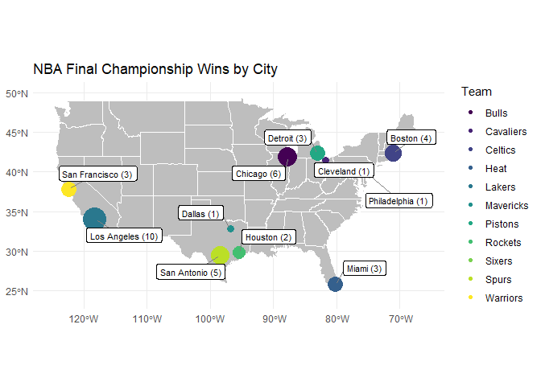
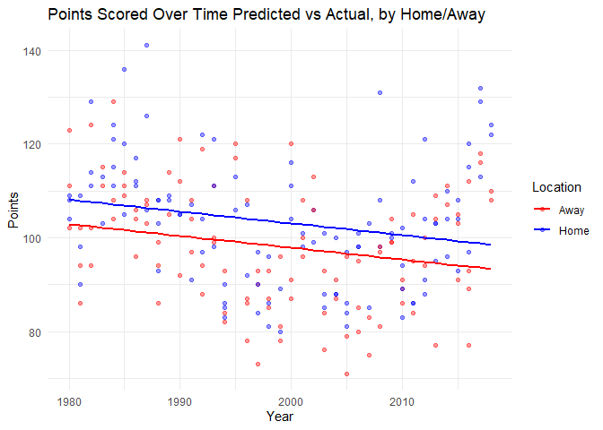
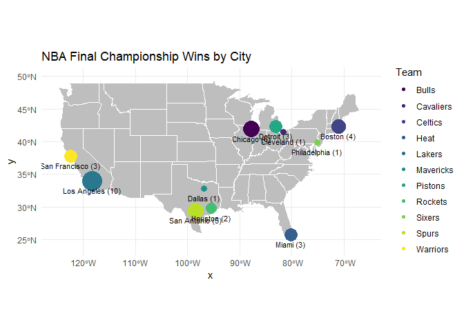

# Data Visualization Project 02


```r
df <- read_csv("C:\\Users\\Aweso\\Documents\\GitHub\\dataviz_final_project\\data\\NBAchampionsdata_with_locations.csv")
df
```

```
## # A tibble: 220 x 28
##     Year Team     Game   Win  Home    MP    FG   FGA   FGP    TP   TPA    TPP
##    <dbl> <chr>   <dbl> <dbl> <dbl> <dbl> <dbl> <dbl> <dbl> <dbl> <dbl>  <dbl>
##  1  1980 Lakers      1     1     1   240    48    89 0.539     0     0 NA    
##  2  1980 Lakers      2     0     1   240    48    95 0.505     0     1  0    
##  3  1980 Lakers      3     1     0   240    44    92 0.478     0     1  0    
##  4  1980 Lakers      4     0     0   240    44    93 0.473     0     0 NA    
##  5  1980 Lakers      5     1     1   240    41    91 0.451     0     0 NA    
##  6  1980 Lakers      6     1     0   240    45    92 0.489     0     2  0    
##  7  1981 Celtics     1     1     1   240    41    95 0.432     0     1  0    
##  8  1981 Celtics     2     0     1   240    41    82 0.5       0     3  0    
##  9  1981 Celtics     3     1     0   240    40    89 0.449     2     3  0.667
## 10  1981 Celtics     4     0     0   240    35    74 0.473     0     3  0    
## # ... with 210 more rows, and 16 more variables: FT <dbl>, FTA <dbl>,
## #   FTP <dbl>, ORB <dbl>, DRB <dbl>, TRB <dbl>, AST <dbl>, STL <dbl>,
## #   BLK <dbl>, TOV <dbl>, PF <dbl>, PTS <dbl>, City <chr>, State <chr>,
## #   Longitude <dbl>, Latitude <dbl>
```

In order to get this data in a working order, I had to enrich the data with location information for each team. This process was done through ChatGPT by asking it to add city and state information to the data set. Overall, the creation of these visualizations went relatively smooth after enriching the data. The most difficult part was navigating the map graph in terms of syntax for the geom_sf part of the code. 

I applied the principles of data visualization and design by creating these visualizations with a clear purpose in mind. Each visualization has a single goal and is congruent on a common visual theme. Combining these three visuals allows the reader to understand the performance of each team and how they succeeded within the finals.

I think this data set is a little rough to deal with. It houses plenty of information on a per game basis but doesn't give any information about the other team. This makes it hard to draw cohesive conclusions due to the lack of information on how the other team performed. Supplying the other team's stats would aid in understanding where each team fell short and where they succeeded


```r
finals <- df %>%
  filter(Win == 1) %>%
  group_by(Year, Team, City, Longitude, Latitude) %>%
  summarise(games_won = n(), .groups = "drop") %>%
  group_by(Year) %>%
  slice_max(games_won, n = 1, with_ties = FALSE) %>%
  ungroup()

city_wins <- finals %>%
  group_by(City, Longitude, Latitude, Team) %>%
  summarise(wins = n(), .groups = "drop") %>%
  group_by(City) %>%
  slice_max(wins, n = 1) %>%
  ungroup()

us_states <- st_as_sf(maps::map("state", plot = FALSE, fill = TRUE))

city_sf <- city_wins %>%
  st_as_sf(coords = c("Longitude", "Latitude"), crs = 4326)


ggplot() +
  geom_sf(data = us_states, fill = "grey", colour = "white") +
  geom_sf(data = city_sf, aes(size = wins, colour = Team)) +
  geom_label_repel(
    data = city_wins,
    aes(x = Longitude, y = Latitude, label = paste0(City, " (", wins, ")")),
    size = 3,
    box.padding = 0.5,      # space around label
    point.padding = 0.3,    # space between label and point
    segment.color = "gray50" # line connecting label to point
  ) +
  scale_colour_viridis_d(name = "Team") +
  scale_size_continuous(range = c(3, 10), guide = "none") +
  coord_sf(xlim = c(-125, -66), ylim = c(24, 50)) +
  labs(title = "NBA Final Championship Wins by City") +
  theme_minimal() +
  theme(axis.title = element_blank())
```



The map I created displays the number of playoff final wins each team has gotten between 1980 and 2018. This dot plot size is dependent on the number of wins each team has gotten. Additionally, the color of the dot showcases the team's primary color and help identify them. I feel this visualization is intersting because it highlights two dominate states within the time-frame. California has two teams and a total of 13 final playoff wins. Meanwhile, Texas has three teams with 8 total final playoff wins. This showcases the domincance the teams in California had during this period, especially considering the Lakers have the most final wins within the data set.


```r
final_games <- df %>%
  filter(Win == 1) %>%
  group_by(Year) %>%
  slice_max(Game, n = 1) %>%
  ungroup()

plot_ly(final_games, x = ~Year, y = ~TP, type = "bar", color = ~Team, colors = viridis::viridis(n_distinct(final_games$Team))) %>%
  layout(updatemenus = list(list(type = "dropdown", buttons = list(
          list(method = "restyle", args = list("y", list(final_games$TPP)),  label = "3 Point %"),
          list(method = "restyle", args = list("y", list(final_games$FG)),   label = "Field Goals"),
          list(method = "restyle", args = list("y", list(final_games$FGP)),  label = "Field Goal %"),
          list(method = "restyle", args = list("y", list(final_games$FT)),   label = "Free Throws"),
          list(method = "restyle", args = list("y", list(final_games$FTP)),  label = "Free Throw %"),
          list(method = "restyle", args = list("y", list(final_games$PTS)),  label = "Points"),
          list(method = "restyle", args = list("y", list(final_games$AST)),  label = "Assists"),
          list(method = "restyle", args = list("y", list(final_games$BLK)),  label = "Blocks"),
          list(method = "restyle", args = list("y", list(final_games$STL)),  label = "Steals"),
          list(method = "restyle", args = list("y", list(final_games$TRB)),  label = "Total Rebounds"),
          list(method = "restyle", args = list("y", list(final_games$ORB)),  label = "Offensive Rebounds"),
          list(method = "restyle", args = list("y", list(final_games$DRB)),  label = "Defensive Rebounds"),
          list(method = "restyle", args = list("y", list(final_games$TOV)),  label = "Turnovers")
        )
      )
    )
  )
```

```{=html}
<div id="htmlwidget-d0a0669ebe0025cfcd3f" style="width:672px;height:480px;" class="plotly html-widget"></div>
<script type="application/json" data-for="htmlwidget-d0a0669ebe0025cfcd3f">{"x":{"visdat":{"75f4924820":["function () ","plotlyVisDat"]},"cur_data":"75f4924820","attrs":{"75f4924820":{"x":{},"y":{},"color":{},"colors":["#440154FF","#482576FF","#414487FF","#35608DFF","#2A788EFF","#21908CFF","#22A884FF","#43BF71FF","#7AD151FF","#BBDF27FF","#FDE725FF"],"alpha_stroke":1,"sizes":[10,100],"spans":[1,20],"type":"bar"}},"layout":{"margin":{"b":40,"l":60,"t":25,"r":10},"updatemenus":[{"type":"dropdown","buttons":[{"method":"restyle","args":["y",[[0,0.25,null,0,0,0,0.5,0,0.3,0.667,0.667,0.667,0.462,0.714,0.364,0.407,0.36,0.357,0.4,0.385,0.588,0.706,0.579,0.2,0.143,0.636,0.111,0.263,0.5,0.5,0.2,0.423,0.538,0.375,0.462,0.382,0.24,0.368,0.368]]],"label":"3 Point %"},{"method":"restyle","args":["y",[[45,43,47,42,34,43,49,45,43,34,37,42,38,39,34,40,31,31,34,27,43,32,37,34,35,29,35,29,43,35,27,41,40,36,37,37,33,46,39]]],"label":"Field Goals"},{"method":"restyle","args":["y",[[0.489,0.551,0.54,0.519,0.395,0.512,0.485,0.484,0.558,0.486,0.457,0.538,0.521,0.476,0.466,0.455,0.397,0.383,0.507,0.403,0.478,0.451,0.521,0.459,0.461,0.426,0.449,0.426,0.494,0.438,0.325,0.5,0.519,0.439,0.474,0.435,0.402,0.511,0.453]]],"label":"Field Goal %"},{"method":"restyle","args":["y",[[33,15,20,31,43,25,12,16,19,35,14,22,15,11,18,22,16,23,15,19,20,32,28,17,28,16,23,20,32,21,25,12,27,11,18,18,21,23,16]]],"label":"Free Throws"},{"method":"restyle","args":["y",[[0.943,0.833,0.8,0.775,0.843,0.694,0.667,0.696,0.704,0.686,0.609,0.786,0.714,0.55,0.783,0.759,0.8,0.767,0.789,0.76,0.606,0.711,0.757,0.68,0.718,0.842,0.622,0.588,0.865,0.75,0.676,0.667,0.818,0.688,0.783,0.621,0.84,0.821,1]]],"label":"Free Throw %"},{"method":"restyle","args":["y",[[123,102,114,115,111,111,111,106,108,105,92,108,97,99,90,113,87,90,87,78,116,108,113,88,100,81,95,83,131,99,83,105,121,95,104,105,93,129,108]]],"label":"Points"},{"method":"restyle","args":["y",[[27,26,33,29,18,27,34,33,30,21,15,28,20,24,22,28,20,15,17,20,25,21,28,20,18,14,18,13,33,13,11,19,25,14,25,28,17,27,25]]],"label":"Assists"},{"method":"restyle","args":["y",[[4,0,11,11,3,2,13,9,1,4,6,6,5,2,5,1,4,4,4,2,7,10,3,13,2,7,10,2,4,8,3,1,7,4,4,4,6,2,13]]],"label":"Blocks"},{"method":"restyle","args":["y",[[14,6,12,9,11,10,9,11,6,3,9,14,8,6,8,11,14,7,11,7,5,6,7,4,8,4,9,5,18,6,7,11,8,8,5,11,7,8,7]]],"label":"Steals"},{"method":"restyle","args":["y",[[52,37,49,41,52,44,56,44,41,36,44,37,31,39,33,48,51,50,22,40,44,47,39,55,50,38,56,45,48,47,53,40,41,43,40,39,48,42,44]]],"label":"Total Rebounds"},{"method":"restyle","args":["y",[[17,9,15,13,20,12,23,13,10,9,16,10,9,12,3,15,24,15,5,9,13,14,7,11,20,8,14,11,14,13,23,10,8,11,6,7,9,13,10]]],"label":"Offensive Rebounds"},{"method":"restyle","args":["y",[[35,28,34,28,32,32,33,31,31,27,28,27,22,27,30,33,27,35,17,31,31,33,32,44,30,30,42,34,34,34,30,30,33,32,34,32,39,29,34]]],"label":"Defensive Rebounds"},{"method":"restyle","args":["y",[[17,13,22,17,14,12,14,11,18,9,18,18,18,8,9,10,19,13,9,14,5,12,9,19,12,13,19,14,7,10,11,14,13,16,8,9,11,13,8]]],"label":"Turnovers"}]}],"xaxis":{"domain":[0,1],"automargin":true,"title":"Year"},"yaxis":{"domain":[0,1],"automargin":true,"title":"TP"},"hovermode":"closest","showlegend":true},"source":"A","config":{"modeBarButtonsToAdd":["hoverclosest","hovercompare"],"showSendToCloud":false},"data":[{"x":[1991,1992,1993,1996,1997,1998],"y":[2,6,10,9,5,4],"type":"bar","name":"Bulls","marker":{"color":"rgba(68,1,84,1)","line":{"color":"rgba(68,1,84,1)"}},"textfont":{"color":"rgba(68,1,84,1)"},"error_y":{"color":"rgba(68,1,84,1)"},"error_x":{"color":"rgba(68,1,84,1)"},"xaxis":"x","yaxis":"y","frame":null},{"x":[2016],"y":[6],"type":"bar","name":"Cavaliers","marker":{"color":"rgba(72,37,118,1)","line":{"color":"rgba(72,37,118,1)"}},"textfont":{"color":"rgba(72,37,118,1)"},"error_y":{"color":"rgba(72,37,118,1)"},"error_x":{"color":"rgba(72,37,118,1)"},"xaxis":"x","yaxis":"y","frame":null},{"x":[1981,1984,1986,2008],"y":[1,0,1,13],"type":"bar","name":"Celtics","marker":{"color":"rgba(65,68,135,1)","line":{"color":"rgba(65,68,135,1)"}},"textfont":{"color":"rgba(65,68,135,1)"},"error_y":{"color":"rgba(65,68,135,1)"},"error_x":{"color":"rgba(65,68,135,1)"},"xaxis":"x","yaxis":"y","frame":null},{"x":[2006,2012,2013],"y":[2,14,12],"type":"bar","name":"Heat","marker":{"color":"rgba(53,96,141,1)","line":{"color":"rgba(53,96,141,1)"}},"textfont":{"color":"rgba(53,96,141,1)"},"error_y":{"color":"rgba(53,96,141,1)"},"error_x":{"color":"rgba(53,96,141,1)"},"xaxis":"x","yaxis":"y","frame":null},{"x":[1980,1982,1985,1987,1988,2000,2001,2002,2009,2010],"y":[0,0,0,0,3,10,12,11,8,4],"type":"bar","name":"Lakers","marker":{"color":"rgba(42,120,142,1)","line":{"color":"rgba(42,120,142,1)"}},"textfont":{"color":"rgba(42,120,142,1)"},"error_y":{"color":"rgba(42,120,142,1)"},"error_x":{"color":"rgba(42,120,142,1)"},"xaxis":"x","yaxis":"y","frame":null},{"x":[2011],"y":[11],"type":"bar","name":"Mavericks","marker":{"color":"rgba(33,144,140,1)","line":{"color":"rgba(33,144,140,1)"}},"textfont":{"color":"rgba(33,144,140,1)"},"error_y":{"color":"rgba(33,144,140,1)"},"error_x":{"color":"rgba(33,144,140,1)"},"xaxis":"x","yaxis":"y","frame":null},{"x":[1989,1990,2004],"y":[2,4,2],"type":"bar","name":"Pistons","marker":{"color":"rgba(34,168,132,1)","line":{"color":"rgba(34,168,132,1)"}},"textfont":{"color":"rgba(34,168,132,1)"},"error_y":{"color":"rgba(34,168,132,1)"},"error_x":{"color":"rgba(34,168,132,1)"},"xaxis":"x","yaxis":"y","frame":null},{"x":[1994,1995],"y":[4,11],"type":"bar","name":"Rockets","marker":{"color":"rgba(67,191,113,1)","line":{"color":"rgba(67,191,113,1)"}},"textfont":{"color":"rgba(67,191,113,1)"},"error_y":{"color":"rgba(67,191,113,1)"},"error_x":{"color":"rgba(67,191,113,1)"},"xaxis":"x","yaxis":"y","frame":null},{"x":[1983],"y":[0],"type":"bar","name":"Sixers","marker":{"color":"rgba(122,209,81,1)","line":{"color":"rgba(122,209,81,1)"}},"textfont":{"color":"rgba(122,209,81,1)"},"error_y":{"color":"rgba(122,209,81,1)"},"error_x":{"color":"rgba(122,209,81,1)"},"xaxis":"x","yaxis":"y","frame":null},{"x":[1999,2003,2005,2007,2014],"y":[5,3,7,5,12],"type":"bar","name":"Spurs","marker":{"color":"rgba(187,223,39,1)","line":{"color":"rgba(187,223,39,1)"}},"textfont":{"color":"rgba(187,223,39,1)"},"error_y":{"color":"rgba(187,223,39,1)"},"error_x":{"color":"rgba(187,223,39,1)"},"xaxis":"x","yaxis":"y","frame":null},{"x":[2015,2017,2018],"y":[13,14,14],"type":"bar","name":"Warriors","marker":{"color":"rgba(253,231,37,1)","line":{"color":"rgba(253,231,37,1)"}},"textfont":{"color":"rgba(253,231,37,1)"},"error_y":{"color":"rgba(253,231,37,1)"},"error_x":{"color":"rgba(253,231,37,1)"},"xaxis":"x","yaxis":"y","frame":null}],"highlight":{"on":"plotly_click","persistent":false,"dynamic":false,"selectize":false,"opacityDim":0.2,"selected":{"opacity":1},"debounce":0},"shinyEvents":["plotly_hover","plotly_click","plotly_selected","plotly_relayout","plotly_brushed","plotly_brushing","plotly_clickannotation","plotly_doubleclick","plotly_deselect","plotly_afterplot","plotly_sunburstclick"],"base_url":"https://plot.ly"},"evals":[],"jsHooks":[]}</script>
```

This interactive visualization showcases a breakdown of Final game stats through the years that are crucial within the game of basketball. This helps understand how the game has evolved over the years and paints the picture of how the teams performed during the final game each year. For instance, when looking at the number of free throws points, we can see outliers at 43 for both the 1988 Lakers, the 1997 Bulls, and the 2014 Spurs. This highlights that they may have relied more on getting fouled and scoring points at the line then other teams. Insights like these is what makes this visualization intersting. 


```r
model <- lm(PTS ~ Year + Home, data = df)

df$predicted <- predict(model)

df %>%
  ggplot(aes(x = Year, y = PTS, colour = factor(Home))) +
  geom_point(alpha = 0.4) +
  geom_line(aes(y = predicted, group = factor(Home)), linewidth = 1) +
  scale_colour_manual(values = c("0" = "red", "1" = "blue"), labels = c("0" = "Away", "1" = "Home"), name = "Location") +
  labs(title = "Points Scored Over Time Predicted vs Actual, by Home/Away", x = "Year", y = "Points") +
  theme_minimal()
```

<!-- -->

Lastly, I was interested in exploring whether being home or away had an influence on points scored in the final game. With this graph we can see that it's evident that being home or away has a statistically significant effect on points scored for the wining team. Additionally, we can see that there is a consistent down trend in the number of points being scored as the years go on. Despite these takeaways, being home or away onl;y accounts for 8.3% of the variation. There are still plenty of other variables at play that draw more correlation to points being scored. Things like player match-ups, plays, and other situation variables have much more to do with the number of points being scored than something like being at home court does.


```r
summary(model)
```

```
## 
## Call:
## lm(formula = PTS ~ Year + Home, data = df)
## 
## Residuals:
##     Min      1Q  Median      3Q     Max 
## -25.630  -9.480  -0.601   8.455  34.643 
## 
## Coefficients:
##              Estimate Std. Error t value Pr(>|t|)    
## (Intercept) 602.23969  152.99085   3.936 0.000111 ***
## Year         -0.25218    0.07654  -3.295 0.001151 ** 
## Home          5.20581    1.72769   3.013 0.002893 ** 
## ---
## Signif. codes:  0 '***' 0.001 '**' 0.01 '*' 0.05 '.' 0.1 ' ' 1
## 
## Residual standard error: 12.81 on 217 degrees of freedom
## Multiple R-squared:  0.08278,	Adjusted R-squared:  0.07433 
## F-statistic: 9.793 on 2 and 217 DF,  p-value: 8.475e-05
```

```r
model2 <- lm(PTS ~ Year + Home + TRB + TOV + TPP, data = df)
```


```r
summary(model2)
```

```
## 
## Call:
## lm(formula = PTS ~ Year + Home + TRB + TOV + TPP, data = df)
## 
## Residuals:
##     Min      1Q  Median      3Q     Max 
## -25.492  -8.458  -0.595   7.076  33.706 
## 
## Coefficients:
##              Estimate Std. Error t value Pr(>|t|)    
## (Intercept) 770.69310  160.77960   4.793 3.12e-06 ***
## Year         -0.34445    0.08017  -4.297 2.66e-05 ***
## Home          3.76890    1.73693   2.170  0.03115 *  
## TRB           0.43590    0.14185   3.073  0.00240 ** 
## TOV          -0.66150    0.23546  -2.809  0.00544 ** 
## TPP          20.77600    5.18646   4.006 8.60e-05 ***
## ---
## Signif. codes:  0 '***' 0.001 '**' 0.01 '*' 0.05 '.' 0.1 ' ' 1
## 
## Residual standard error: 12.15 on 208 degrees of freedom
##   (6 observations deleted due to missingness)
## Multiple R-squared:  0.1883,	Adjusted R-squared:  0.1688 
## F-statistic: 9.652 on 5 and 208 DF,  p-value: 2.656e-08
```
Within the second model, I added total rebounds, turnovers, and three-point percentages and it definitely drives home additional value into the model. This now over doubles the R^2 meaning it takes into account 19% of the variation. Even still, at 19% there is plenty of other variables at hand in a basketball game that contribute to the overall number of points being scored.


## Previous Version


```r
ggplot() +
  geom_sf(data = us_states, fill = "grey", colour = "white") +
  geom_sf(data = city_sf, aes(size = wins, colour = Team)) +
  geom_sf_text(data = city_sf, aes(label = paste0(City, " (", wins, ")")), vjust = 2, size = 3) +
 scale_colour_viridis_d(name = "Team") +
  scale_size_continuous(range = c(3, 10), guide = "none") +
  coord_sf(xlim = c(-125, -66), ylim = c(24, 50)) +
  labs(title = "NBA Final Championship Wins by City") +
  theme_minimal()
```



The new version of this map is better because is spaces out the labels in a way where they are no longer overlapping. This makes it much more readable and easier to understand for the viewer.
