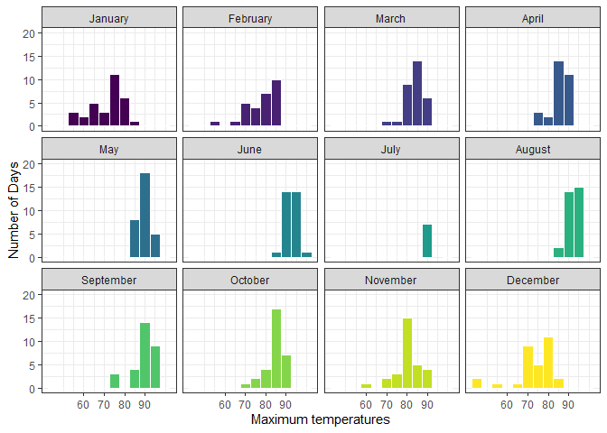
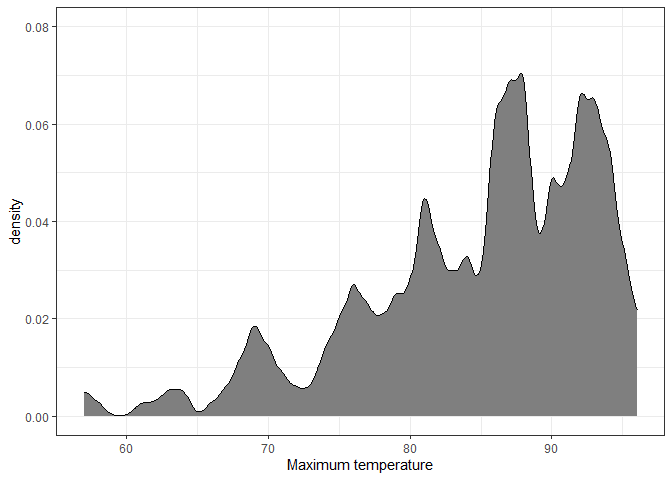
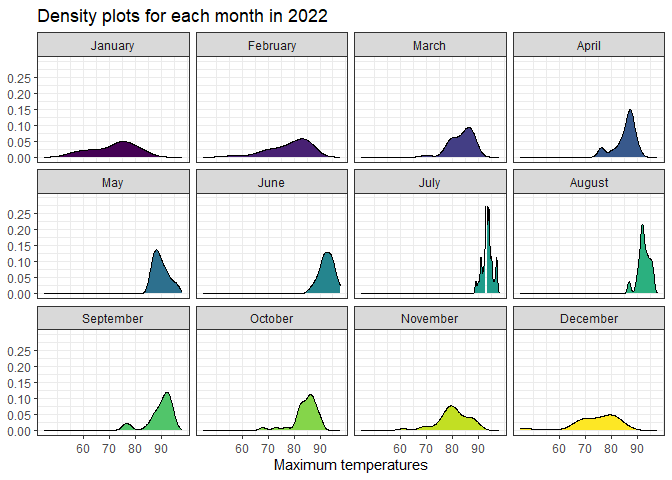
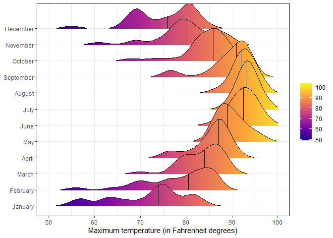
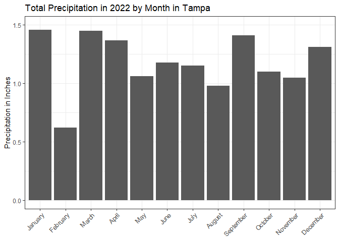
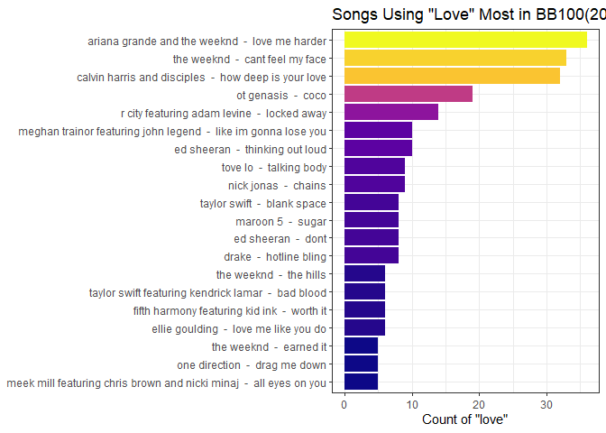

# Data Visualization Project 03


In this exercise you will explore methods to create different types of data visualizations (such as plotting text data, or exploring the distributions of continuous variables).


## PART 1: Density Plots

Using the dataset obtained from FSU's [Florida Climate Center](https://climatecenter.fsu.edu/climate-data-access-tools/downloadable-data), for a station at Tampa International Airport (TPA) for 2022, attempt to recreate the charts shown below which were generated using data from 2016. You can read the 2022 dataset using the code below: 


```r
library(tidyverse)
library(lubridate)
library(plotly)
weather_tpa <- read_csv("https://raw.githubusercontent.com/aalhamadani/datasets/master/tpa_weather_2022.csv")
# random sample 
sample_n(weather_tpa, 4)
```

```
## # A tibble: 4 x 7
##    year month   day precipitation max_temp min_temp ave_temp
##   <dbl> <dbl> <dbl>         <dbl>    <dbl>    <dbl>    <dbl>
## 1  2022     6     5          0          91       75     83  
## 2  2022     1     1          0          82       67     74.5
## 3  2022     4     2          1.11       83       65     74  
## 4  2022     6    23          0          93       79     86
```

See Slides from Week 4 of Visualizing Relationships and Models (slide 10) for a reminder on how to use this type of dataset with the `lubridate` package for dates and times (example included in the slides uses data from 2016).

Using the 2022 data: 

(a) Create a plot like the one below:


```r
weather_tpa2 <- weather_tpa %>%
  filter(year == 2022) %>%
  mutate(date = make_date(year, month, day), month = factor(month(date, label = TRUE, abbr = FALSE), levels = month.name)) 

  ggplot(weather_tpa2, aes(x = max_temp, fill = month)) +
  geom_histogram(binwidth = 5, color = "white", show.legend = FALSE) +
  facet_wrap(~ month, ncol = 4) +
  scale_fill_viridis_d(option = "viridis") +
  scale_x_continuous(breaks = seq(60, 90, by = 10)) +
  scale_y_continuous(limits = c(0, 20)) +
  labs(
    x = "Maximum temperatures",
    y = "Number of Days"
  ) +
  theme_bw()
```

```
## Warning: Removed 1 rows containing missing values (`geom_bar()`).
```




Hint: the option `binwidth = 3` was used with the `geom_histogram()` function.

(b) Create a plot like the one below:


```r
weather_tpa2 %>%
  ggplot(aes(x = max_temp)) +
  geom_density(fill = "gray50", color = "black", bw = 0.5) +
  scale_x_continuous(limits = c(57, 96)) +
  scale_y_continuous(limits = c(0, 0.08)) + 
  labs(
    x = "Maximum temperature",
    y = "density"
  ) +
  theme_bw()
```

```
## Warning: Removed 10 rows containing non-finite values (`stat_density()`).
```




Hint: check the `kernel` parameter of the `geom_density()` function, and use `bw = 0.5`.

(c) Create a plot like the one below:


```r
weather_tpa2 %>%
  ggplot(aes(x = max_temp, fill = month)) +
  geom_density(color = "black", show.legend = FALSE) +
  scale_y_continuous(breaks = seq(0, 0.25, by = 0.05), limits = c(0, 0.30)) +
  facet_wrap(~ month, ncol = 4) +
  scale_fill_viridis_d(option = "viridis") +
  scale_x_continuous(breaks = seq(60, 90, by = 10)) +
  labs(
    title = "Density plots for each month in 2022",
    x = "Maximum temperatures",
    y = NULL
  ) +
  theme_bw()
```




Hint: default options for `geom_density()` were used. 

(d) Generate a plot like the chart below:


```r
library(ggridges)

weather_tpa %>%
  mutate(month = factor(month, levels = 1:12, labels = month.name)) %>%
  ggplot(aes(x = max_temp, y = month, fill = after_stat(x))) +
  geom_density_ridges_gradient(
    scale = 3,
    rel_min_height = 0.01,
    quantile_lines = TRUE,
    quantiles = 2,
    color = "black"
  ) +
  scale_fill_viridis_c(option = "plasma", name = NULL) +
  scale_x_continuous(breaks = seq(50, 100, by = 10), limits = c(50, 100)) +
  labs(
    x = "Maximum temperature (in Fahrenheit degrees)",
    y = NULL
  ) +
  theme_bw()
```

```
## Picking joint bandwidth of 1.87
```

```
## Warning: Using the `size` aesthietic with geom_segment was deprecated in ggplot2 3.4.0.
## i Please use the `linewidth` aesthetic instead.
```



Hint: use the`{ggridges}` package, and the `geom_density_ridges()` function paying close attention to the `quantile_lines` and `quantiles` parameters. The plot above uses the `plasma` option (color scale) for the _viridis_ palette.

(e) Create a plot of your choice that uses the attribute for precipitation _(values of -99.9 for temperature or -99.99 for precipitation represent missing data)_.


```r
weather_tpa2 %>%
  filter(precipitation != -99.9) %>%
  ggplot(aes(x = month, y = precipitation)) +
  geom_col(show.legend = FALSE) +
  scale_y_continuous(limits = c(0, 1.5)) +
  labs(
    title = "Total Precipitation in 2022 by Month in Tampa",
    x = NULL,
    y = "Precipitation in Inches"
  ) +
  theme_bw() +
  theme(
    axis.text.x = element_text(angle = 45, hjust = 1)
  )
```

```
## Warning: Removed 12 rows containing missing values (`position_stack()`).
```

```
## Warning: Removed 142 rows containing missing values (`geom_col()`).
```




## PART 2 

> **You can choose to work on either Option (A) or Option (B)**. Remove from this template the option you decided not to work on. 


### Option (A): Visualizing Text Data

Review the set of slides (and additional resources linked in it) for visualizing text data: Week 6 PowerPoint slides of Visualizing Text Data. 

Choose any dataset with text data, and create at least one visualization with it. For example, you can create a frequency count of most used bigrams, a sentiment analysis of the text data, a network visualization of terms commonly used together, and/or a visualization of a topic modeling approach to the problem of identifying words/documents associated to different topics in the text data you decide to use. 

Make sure to include a copy of the dataset in the `data/` folder, and reference your sources if different from the ones listed below:

- [Billboard Top 100 Lyrics](https://raw.githubusercontent.com/aalhamadani/dataviz_final_project/main/data/BB_top100_2015.csv)

- [RateMyProfessors comments](https://raw.githubusercontent.com/aalhamadani/dataviz_final_project/main/data/rmp_wit_comments.csv)

- [FL Poly News Articles](https://raw.githubusercontent.com/aalhamadani/dataviz_final_project/main/data/flpoly_news_SP23.csv)


(to get the "raw" data from any of the links listed above, simply click on the `raw` button of the GitHub page and copy the URL to be able to read it in your computer using the `read_csv()` function)


```r
df <- read_csv('https://raw.githubusercontent.com//aalhamadani//dataviz_final_project//main/data//BB_top100_2015.csv')
```

```
## Rows: 100 Columns: 6
## -- Column specification --------------------------------------------------------
## Delimiter: ","
## chr (3): Song, Artist, Lyrics
## dbl (3): Rank, Year, Source
## 
## i Use `spec()` to retrieve the full column specification for this data.
## i Specify the column types or set `show_col_types = FALSE` to quiet this message.
```

```r
df
```

```
## # A tibble: 100 x 6
##     Rank Song              Artist                             Year Lyrics Source
##    <dbl> <chr>             <chr>                             <dbl> <chr>   <dbl>
##  1     1 uptown funk       mark ronson featuring bruno mars   2015 this ~      1
##  2     2 thinking out loud ed sheeran                         2015 when ~      1
##  3     3 see you again     wiz khalifa featuring charlie pu~  2015 its b~      1
##  4     4 trap queen        fetty wap                          2015 im li~      1
##  5     5 sugar             maroon 5                           2015 im hu~      1
##  6     6 shut up and dance walk the moon                      2015 oh do~      1
##  7     7 blank space       taylor swift                       2015 nice ~      1
##  8     8 watch me          silento                            2015 now w~      1
##  9     9 earned it         the weeknd                         2015 you m~      1
## 10    10 the hills         the weeknd                         2015 your ~      1
## # ... with 90 more rows
```


```r
df %>%
  mutate(Lyrics = str_to_lower(Lyrics)) %>%
  mutate(word = str_split(Lyrics, "\\s+")) %>%
  unnest(word) %>%
  filter(word == "love") %>%
  count(Song, Artist, word, sort = TRUE) %>%
  slice_head(n = 20) %>%
  mutate(label = paste(Artist, " - ", Song)) %>%
  ggplot(aes(x = reorder(label, n), y = n, fill = n)) +
  geom_col(show.legend = FALSE) +
  coord_flip() +
  scale_fill_viridis_c(option = "plasma") +
  labs(
    title = 'Songs Using "Love" Most in BB100(2015)',
    x = NULL,
    y = 'Count of "love"'
  ) +
  theme_bw()
```



## Recreated Interactive Version


```r
weather_tpa %>%
  mutate(month = factor(month, levels = 1:12, labels = month.name)) %>%
  plot_ly(x = ~max_temp, color = ~month,
          colors = "plasma", type = "violin",
          box = list(visible = TRUE),
          meanline = list(visible = TRUE)) %>%
  layout(
    title = "Max Temperature by Month",
    xaxis = list(title = "Maximum temperature (in Fahrenheit degrees)"),
    yaxis = list(title = ""),
    updatemenus = list(
      list(
        type = "dropdown",
        buttons = lapply(month.name, function(m) {
          list(method = "restyle",
               args = list("visible", as.list(month.name == m)),
               label = m)
        })
      )
    )
  )
```

```{=html}
<div id="htmlwidget-ec9754eebf2ad435caf1" style="width:672px;height:480px;" class="plotly html-widget"></div>
<script type="application/json" data-for="htmlwidget-ec9754eebf2ad435caf1">{"x":{"visdat":{"169874875203":["function () ","plotlyVisDat"]},"cur_data":"169874875203","attrs":{"169874875203":{"x":{},"box":{"visible":true},"meanline":{"visible":true},"color":{},"colors":"plasma","alpha_stroke":1,"sizes":[10,100],"spans":[1,20],"type":"violin"}},"layout":{"margin":{"b":40,"l":60,"t":25,"r":10},"title":"Max Temperature by Month","xaxis":{"domain":[0,1],"automargin":true,"title":"Maximum temperature (in Fahrenheit degrees)"},"yaxis":{"domain":[0,1],"automargin":true,"title":""},"updatemenus":[{"type":"dropdown","buttons":[{"method":"restyle","args":["visible",[true,false,false,false,false,false,false,false,false,false,false,false]],"label":"January"},{"method":"restyle","args":["visible",[false,true,false,false,false,false,false,false,false,false,false,false]],"label":"February"},{"method":"restyle","args":["visible",[false,false,true,false,false,false,false,false,false,false,false,false]],"label":"March"},{"method":"restyle","args":["visible",[false,false,false,true,false,false,false,false,false,false,false,false]],"label":"April"},{"method":"restyle","args":["visible",[false,false,false,false,true,false,false,false,false,false,false,false]],"label":"May"},{"method":"restyle","args":["visible",[false,false,false,false,false,true,false,false,false,false,false,false]],"label":"June"},{"method":"restyle","args":["visible",[false,false,false,false,false,false,true,false,false,false,false,false]],"label":"July"},{"method":"restyle","args":["visible",[false,false,false,false,false,false,false,true,false,false,false,false]],"label":"August"},{"method":"restyle","args":["visible",[false,false,false,false,false,false,false,false,true,false,false,false]],"label":"September"},{"method":"restyle","args":["visible",[false,false,false,false,false,false,false,false,false,true,false,false]],"label":"October"},{"method":"restyle","args":["visible",[false,false,false,false,false,false,false,false,false,false,true,false]],"label":"November"},{"method":"restyle","args":["visible",[false,false,false,false,false,false,false,false,false,false,false,true]],"label":"December"}]}],"hovermode":"closest","showlegend":true},"source":"A","config":{"modeBarButtonsToAdd":["hoverclosest","hovercompare"],"showSendToCloud":false},"data":[{"fillcolor":"rgba(13,8,135,0.5)","x":[82,82,75,76,75,74,81,81,84,81,73,77,74,72,75,71,66,64,75,78,76,62,57,63,57,63,74,67,55,58,69],"box":{"visible":true},"meanline":{"visible":true},"type":"violin","name":"January","marker":{"color":"rgba(13,8,135,1)","line":{"color":"rgba(13,8,135,1)"}},"line":{"color":"rgba(13,8,135,1)"},"xaxis":"x","yaxis":"y","frame":null},{"fillcolor":"rgba(62,4,156,0.5)","x":[76,82,85,83,71,64,70,56,69,72,78,80,76,68,75,84,86,81,77,82,86,87,86,86,84,85,82,80],"box":{"visible":true},"meanline":{"visible":true},"type":"violin","name":"February","marker":{"color":"rgba(62,4,156,1)","line":{"color":"rgba(62,4,156,1)"}},"line":{"color":"rgba(62,4,156,1)"},"xaxis":"x","yaxis":"y","frame":null},{"fillcolor":"rgba(99,0,167,0.5)","x":[79,78,83,89,88,89,88,86,86,84,86,79,70,81,84,80,79,87,86,84,85,88,87,77,80,81,81,83,86,88,86],"box":{"visible":true},"meanline":{"visible":true},"type":"violin","name":"March","marker":{"color":"rgba(99,0,167,1)","line":{"color":"rgba(99,0,167,1)"}},"line":{"color":"rgba(99,0,167,1)"},"xaxis":"x","yaxis":"y","frame":null},{"fillcolor":"rgba(135,7,166,0.5)","x":[83,83,80,85,88,87,81,76,76,77,85,88,86,86,87,88,88,91,84,85,87,87,88,90,90,87,88,88,89,87],"box":{"visible":true},"meanline":{"visible":true},"type":"violin","name":"April","marker":{"color":"rgba(135,7,166,1)","line":{"color":"rgba(135,7,166,1)"}},"line":{"color":"rgba(135,7,166,1)"},"xaxis":"x","yaxis":"y","frame":null},{"fillcolor":"rgba(166,32,152,0.5)","x":[86,87,88,88,90,89,87,89,90,87,86,87,86,88,88,87,89,91,90,88,90,96,92,94,95,92,89,92,92,96,93],"box":{"visible":true},"meanline":{"visible":true},"type":"violin","name":"May","marker":{"color":"rgba(166,32,152,1)","line":{"color":"rgba(166,32,152,1)"}},"line":{"color":"rgba(166,32,152,1)"},"xaxis":"x","yaxis":"y","frame":null},{"fillcolor":"rgba(192,58,131,0.5)","x":[89,91,86,88,91,91,92,92,88,91,90,90,92,94,95,95,97,98,94,95,94,92,93,95,92,96,93,95,94,93],"box":{"visible":true},"meanline":{"visible":true},"type":"violin","name":"June","marker":{"color":"rgba(192,58,131,1)","line":{"color":"rgba(192,58,131,1)"}},"line":{"color":"rgba(192,58,131,1)"},"xaxis":"x","yaxis":"y","frame":null},{"fillcolor":"rgba(213,84,110,0.5)","x":[91,91,91,94,94,96,93,94,92,93,89,93,94,92,93,93,90,93,93,93,93,95,94,95,94,94,93,95,97,97,97],"box":{"visible":true},"meanline":{"visible":true},"type":"violin","name":"July","marker":{"color":"rgba(213,84,110,1)","line":{"color":"rgba(213,84,110,1)"}},"line":{"color":"rgba(213,84,110,1)"},"xaxis":"x","yaxis":"y","frame":null},{"fillcolor":"rgba(231,111,90,0.5)","x":[94,96,92,95,96,95,96,94,94,93,90,92,92,87,87,92,92,93,92,96,94,92,92,95,93,91,92,91,90,91,93],"box":{"visible":true},"meanline":{"visible":true},"type":"violin","name":"August","marker":{"color":"rgba(231,111,90,1)","line":{"color":"rgba(231,111,90,1)"}},"line":{"color":"rgba(231,111,90,1)"},"xaxis":"x","yaxis":"y","frame":null},{"fillcolor":"rgba(245,140,70,0.5)","x":[94,91,93,93,94,94,91,87,88,87,90,91,90,87,91,88,92,88,90,92,93,94,93,92,92,93,84,76,77,77],"box":{"visible":true},"meanline":{"visible":true},"type":"violin","name":"September","marker":{"color":"rgba(245,140,70,1)","line":{"color":"rgba(245,140,70,1)"}},"line":{"color":"rgba(245,140,70,1)"},"xaxis":"x","yaxis":"y","frame":null},{"fillcolor":"rgba(253,173,50,0.5)","x":[82,86,84,83,83,84,87,88,90,90,89,85,82,88,88,90,86,81,68,73,77,82,86,86,83,83,85,87,87,87,86],"box":{"visible":true},"meanline":{"visible":true},"type":"violin","name":"October","marker":{"color":"rgba(253,173,50,1)","line":{"color":"rgba(253,173,50,1)"}},"line":{"color":"rgba(253,173,50,1)"},"xaxis":"x","yaxis":"y","frame":null},{"fillcolor":"rgba(252,210,37,0.5)","x":[88,90,88,86,86,89,87,85,76,74,78,81,78,79,81,79,69,69,75,61,79,78,79,79,82,82,81,78,83,82],"box":{"visible":true},"meanline":{"visible":true},"type":"violin","name":"November","marker":{"color":"rgba(252,210,37,1)","line":{"color":"rgba(252,210,37,1)"}},"line":{"color":"rgba(252,210,37,1)"},"xaxis":"x","yaxis":"y","frame":null},{"fillcolor":"rgba(240,249,33,0.5)","x":[77,81,82,80,81,81,84,84,79,80,70,76,80,81,76,68,70,69,74,67,69,69,70,45,46,55,68,75,80,81,71],"box":{"visible":true},"meanline":{"visible":true},"type":"violin","name":"December","marker":{"color":"rgba(240,249,33,1)","line":{"color":"rgba(240,249,33,1)"}},"line":{"color":"rgba(240,249,33,1)"},"xaxis":"x","yaxis":"y","frame":null}],"highlight":{"on":"plotly_click","persistent":false,"dynamic":false,"selectize":false,"opacityDim":0.2,"selected":{"opacity":1},"debounce":0},"shinyEvents":["plotly_hover","plotly_click","plotly_selected","plotly_relayout","plotly_brushed","plotly_brushing","plotly_clickannotation","plotly_doubleclick","plotly_deselect","plotly_afterplot","plotly_sunburstclick"],"base_url":"https://plot.ly"},"evals":[],"jsHooks":[]}</script>
```

The new version make it much more easy to read by spacing out each month. Additionally, the interactivity gives better summary statistics for each month when rolling over it.


